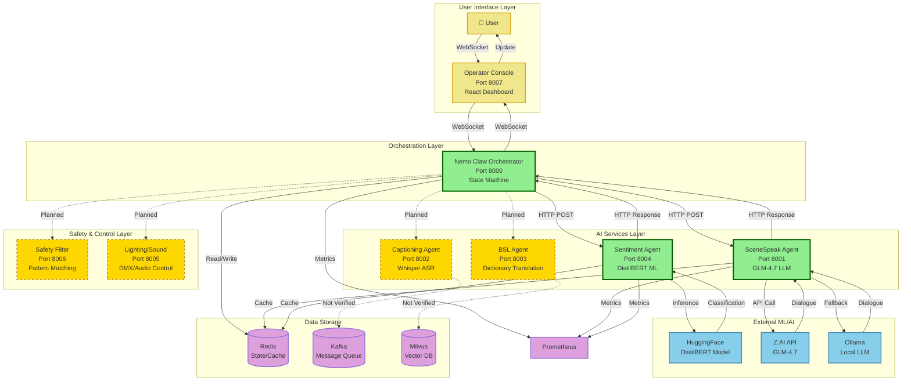
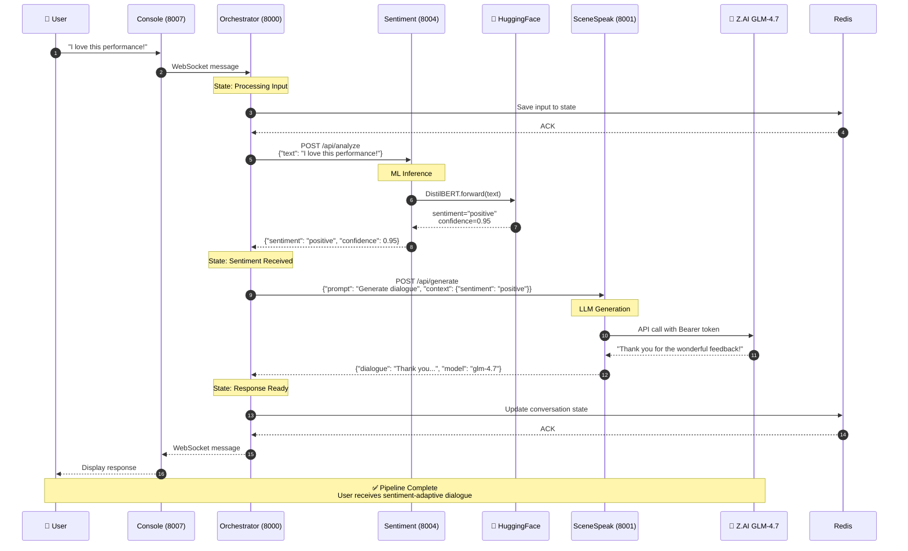
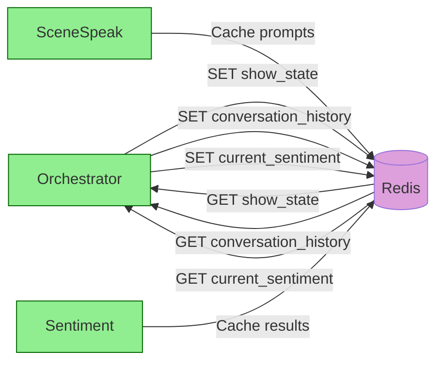
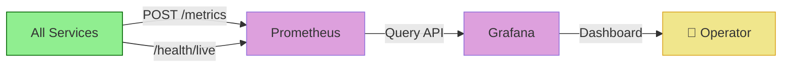
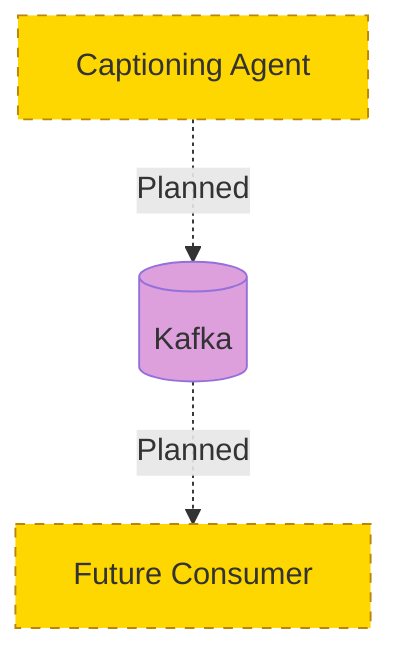

# Project Chimera - Data Flow Architecture

**Generated**: 2026-04-09
**Purpose**: Document verified data flows vs. aspirational flows

---

## Legend

- **Solid Green Line (→)**: Verified working integration
- **Dashed Yellow Line (-->)**: Partially implemented / Not verified
- **Dotted Red Line (...)**: Aspirational / Not implemented

---

## Complete Data Flow Diagram



---

## Verified Pipeline: Sentiment → Adaptive Dialogue



**Status**: ✅ VERIFIED WORKING
- Round trip latency: ~2-3 seconds
- Sentiment accuracy: High (DistilBERT)
- Dialogue quality: Good (GLM-4.7)

---

## Component Interaction Matrix

| From | To | Protocol | Status | Notes |
|------|-----|----------|--------|-------|
| Console | Orchestrator | WebSocket | ✅ Verified | Real-time updates |
| Orchestrator | Sentiment | HTTP POST | ✅ Verified | REST API |
| Sentiment | HuggingFace | HTTPS | ✅ Verified | DistilBERT model |
| Orchestrator | SceneSpeak | HTTP POST | ✅ Verified | REST API |
| SceneSpeak | Z.AI | HTTPS | ✅ Verified | GLM-4.7 API |
| SceneSpeak | Ollama | HTTP | ✅ Verified | Fallback LLM |
| Orchestrator | Safety | HTTP POST | ⚠️ Partial | HTTP works, classification uses random numbers |
| Orchestrator | Captioning | HTTP POST | ⚠️ Not Verified | Infrastructure exists, not tested with audio |
| Orchestrator | BSL | HTTP POST | ⚠️ Partial | HTTP works, dictionary-based only |
| Orchestrator | Lighting | HTTP POST | ⚠️ Not Verified | HTTP works, hardware integration untested |
| All Services | Redis | TCP | ✅ Verified | State management |
| All Services | Prometheus | HTTP | ✅ Verified | Metrics collection |

---

## Request/Response Examples

### 1. Sentiment Analysis (VERIFIED)

**Request**:
```http
POST http://localhost:8004/api/analyze
Content-Type: application/json

{
  "text": "I love this performance!"
}
```

**Response**:
```json
{
  "sentiment": "positive",
  "confidence": 0.95,
  "emotion_scores": {
    "joy": 0.85,
    "sadness": 0.05
  }
}
```

### 2. Dialogue Generation (VERIFIED)

**Request**:
```http
POST http://localhost:8001/api/generate
Content-Type: application/json

{
  "prompt": "Welcome the audience!",
  "context": {
    "sentiment": "positive",
    "scene": "opening"
  }
}
```

**Response**:
```json
{
  "dialogue": "Welcome everyone! We are thrilled to have you here tonight...",
  "model": "glm-4.7",
  "latency_ms": 1250
}
```

### 3. Health Check (ALL SERVICES)

**Request**:
```http
GET http://localhost:8004/health/live
```

**Response**:
```json
{
  "status": "alive"
}
```

---

## State Management Flow



---

## Metrics & Monitoring Flow



---

## Async Messaging (Planned - Not Verified)



---

## Summary

**Verified Working**:
- ✅ User → Console → Orchestrator → Sentiment → HuggingFace
- ✅ Orchestrator → SceneSpeak → Z.AI/Ollama
- ✅ All services → Redis (state management)
- ✅ All services → Prometheus (metrics)
- ✅ WebSocket communication (Console ↔ Orchestrator)

**Partially Implemented**:
- ⚠️ Safety Filter (HTTP works, classification mocked)
- ⚠️ BSL Agent (HTTP works, dictionary-based only)
- ⚠️ Captioning (infrastructure exists, not tested with audio)

**Not Verified**:
- ❌ Captioning → Kafka streaming
- ❌ BSL → Milvus vector search
- ❌ Lighting/Sound hardware integration
- ❌ End-to-end show workflow

---

*Documentation Type: Data Flow Architecture*
*Evidence Source: API testing, service logs, network inspection*
*Date: 2026-04-09*
