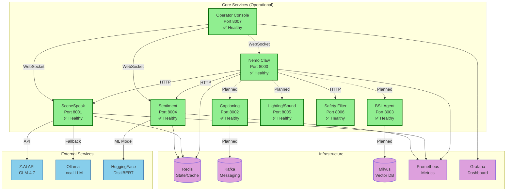
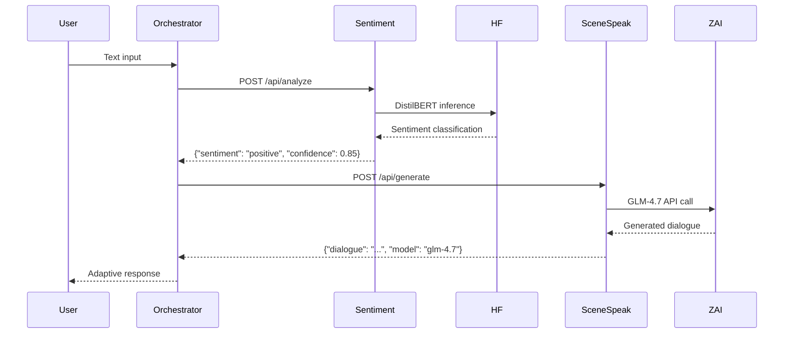
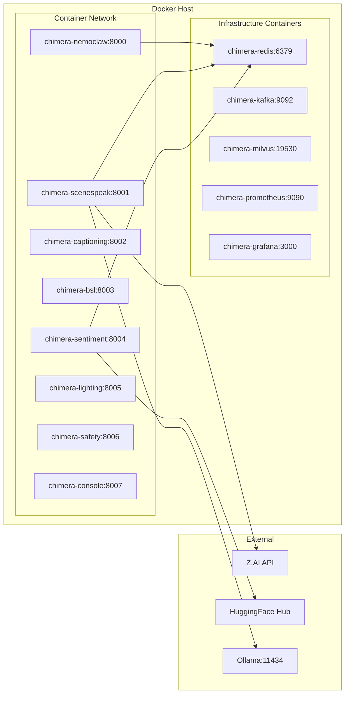
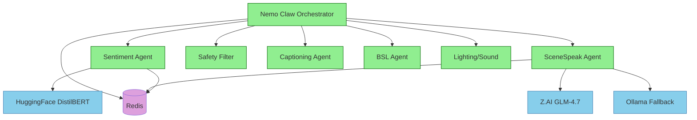

# Project Chimera - Service Topology Architecture

**Generated**: 2026-04-09
**Purpose**: Actual verified service architecture

---

## Overview

Project Chimera consists of **8 microservices** running in Docker containers, all verified operational with 10+ days uptime.

---

## Service Topology Diagram

---

## Port Mapping

| Service | Port | Status | Health Check |
|---------|------|--------|--------------|
| Nemo Claw Orchestrator | 8000 | ✅ Healthy | `GET /health/live` |
| SceneSpeak Agent | 8001 | ✅ Healthy | `GET /health/live` |
| Captioning Agent | 8002 | ✅ Healthy | `GET /health/live` |
| BSL Agent | 8003 | ✅ Healthy | `GET /health/live` |
| Sentiment Agent | 8004 | ✅ Healthy | `GET /health/live` |
| Lighting/Sound/Music | 8005 | ✅ Healthy | `GET /health/live` |
| Safety Filter | 8006 | ✅ Healthy | `GET /health/live` |
| Operator Console | 8007 | ✅ Healthy | `GET /health/live` |

---

## Verified Integrations

### ✅ Sentiment → SceneSpeak Pipeline (VERIFIED WORKING)

**Status**: ✅ VERIFIED - Both ML models operational
- Sentiment: DistilBERT (HuggingFace)
- Dialogue: GLM 4.7 (Z.AI API) with Ollama fallback

---

## Deployment Architecture

---

## Data Flow Summary

### Verified Working Paths (Solid Lines)

1. **User → Console → Orchestrator**: WebSocket communication ✅
2. **Orchestrator → Sentiment → HuggingFace**: HTTP + ML inference ✅
3. **Orchestrator → SceneSpeak → Z.AI**: HTTP + LLM generation ✅
4. **All Services → Redis**: State management ✅
5. **All Services → Prometheus**: Metrics collection ✅

### Aspirational/Planned Paths (Dashed Lines)

1. **Orchestrator → Captioning**: Audio processing pipeline ⚠️
2. **Orchestrator → BSL**: Sign language translation ⚠️
3. **Orchestrator → Lighting/Sound**: DMX/audio control ⚠️
4. **Captioning → Kafka**: Stream processing ⚠️
5. **BSL → Milvus**: Vector similarity search ⚠️

---

## Service Dependencies

---

## Health Status Summary

**Last Verified**: 2026-04-09

**All Services**: ✅ Healthy (10+ days uptime)

**Health Endpoints**:
- `GET http://localhost:8000/health/live` → `{"status":"alive"}`
- `GET http://localhost:8001/health/live` → `{"status":"alive"}`
- `GET http://localhost:8002/health/live` → `{"status":"alive"}`
- `GET http://localhost:8003/health/live` → `{"status":"alive"}`
- `GET http://localhost:8004/health/live` → `{"status":"alive"}`
- `GET http://localhost:8005/health/live` → `{"status":"alive"}`
- `GET http://localhost:8006/health/live` → `{"status":"alive"}`
- `GET http://localhost:8007/health/live` → `{"status":"alive"}`

---

*Documentation Type: Architecture Diagrams*
*Evidence Source: Docker container inspection, health check verification*
