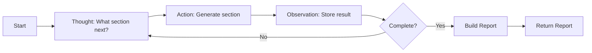
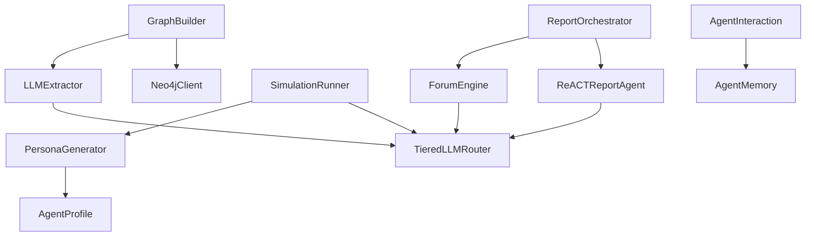

# Component Reference

This document provides detailed technical documentation for all major components in the Chimera Simulation Engine. Each component includes its purpose, key classes and methods, configuration options, dependencies, and usage examples.

## Table of Contents

- [Graph Components](#graph-components)
  - [GraphBuilder](#graphbuilder)
  - [LLMExtractor](#llmextractor)
  - [Neo4jClient](#neo4jclient)
- [Agent Components](#agent-components)
  - [PersonaGenerator](#personagenerator)
  - [AgentProfile](#agentprofile)
  - [AgentInteraction](#agentinteraction)
  - [AgentMemory](#agentmemory)
- [Simulation Components](#simulation-components)
  - [SimulationRunner](#simulationrunner)
  - [TieredLLMRouter](#tieredllmrouter)
- [Reporting Components](#reporting-components)
  - [ReportOrchestrator](#reportorchestrator)
  - [ForumEngine](#forumengine)
  - [ReACTReportAgent](#reactreportagent)

---

## Graph Components

### GraphBuilder

**Location:** `services/simulation-engine/graph/builder.py`

**Purpose:** Orchestrates knowledge graph construction from seed documents using GraphRAG-inspired entity and relationship extraction.

**Key Responsibilities:**
- Extract entities and relationships from documents
- Coordinate LLM-based and fallback extraction methods
- Store extracted data in Neo4j graph database
- Handle extraction failures gracefully

**Key Classes and Methods:**

```python
class GraphBuilder:
    """Builds knowledge graph from seed documents."""

    def __init__(self, client: Any, use_llm_extraction: bool = True):
        """
        Initialize the graph builder.

        Args:
            client: Neo4j client for graph storage
            use_llm_extraction: Enable LLM-based extraction (default: True)
        """

    async def build_from_documents(self, documents: List[str]) -> Dict[str, int]:
        """
        Extract entities and relationships from documents.

        Args:
            documents: List of document texts to process

        Returns:
            Dictionary with entity_count and relationship_count
        """

    async def _extract_entities_llm(self, document: str) -> List[Entity]:
        """LLM-based entity extraction with fallback."""

    async def _extract_relationships_llm(self, entities: List[Entity]) -> List[Relationship]:
        """Extract relationships between entities."""

    async def _extract_entities_simple(self, document: str) -> List[Entity]:
        """Simple regex-based fallback extraction."""

    async def _extract_relationships_simple(self, entities: List[Entity]) -> List[Relationship]:
        """Simple sequential relationship fallback."""
```

**Configuration Options:**

| Parameter | Type | Default | Description |
|-----------|------|---------|-------------|
| `use_llm_extraction` | bool | True | Enable LLM-based extraction |
| `client` | Neo4jClient | Required | Graph database client |

**Dependencies:**
- `LLMExtractor` - For LLM-based extraction
- `Neo4jClient` - For graph storage
- `graph.models` - Entity, Relationship, EntityType data models

**Usage Example:**

```python
from graph.builder import GraphBuilder
from graph.neo4j_client import Neo4jClient

# Initialize
client = Neo4jClient(uri="bolt://localhost:7687")
builder = GraphBuilder(client=client, use_llm_extraction=True)

# Build graph
documents = [
    "Apple Inc. was founded by Steve Jobs in California.",
    "The company is headquartered in Cupertino."
]
result = await builder.build_from_documents(documents)

print(f"Created {result['entities']} entities and {result['relationships']} relationships")
```

**Error Handling:**
- Falls back to simple extraction if LLM extraction fails
- Logs warnings for Neo4j unavailability
- Continues processing remaining documents if one fails

---

### LLMExtractor

**Location:** `services/simulation-engine/graph/llm_extractor.py`

**Purpose:** Extract entities and temporal facts from text using LLM-based analysis with robust fallback mechanisms.

**Key Responsibilities:**
- Extract structured entities with type classification
- Extract temporal facts with valid_at/invalid_at timestamps
- Handle LLM failures with regex-based fallback
- Parse various date formats for temporal reasoning

**Key Classes and Methods:**

```python
class LLMExtractor:
    """Extract entities and facts from text using LLM-based analysis."""

    def __init__(self, llm_backend: LLMBackend = LLMBackend.LOCAL_VLLM):
        """
        Initialize the LLM extractor.

        Args:
            llm_backend: Preferred LLM backend for extraction
        """

    async def extract_entities(self, text: str) -> List[Entity]:
        """
        Use LLM to extract entities with structured output.

        Args:
            text: Input text to extract entities from

        Returns:
            List of extracted Entity objects

        Raises:
            ValueError: If text is empty or too short
        """

    async def extract_facts(self, text: str) -> List[Fact]:
        """
        Extract temporal facts from text with timestamps.

        Args:
            text: Input text to extract facts from

        Returns:
            List of Fact objects with temporal information
        """

    def _parse_date(self, date_input: Any) -> datetime:
        """Parse various date formats into datetime object."""

    def _extract_entities_fallback(self, text: str) -> List[Entity]:
        """Fallback entity extraction using regex patterns."""
```

**Entity Types Supported:**
- `PERSON` - Individual people
- `ORGANIZATION` - Companies, institutions
- `LOCATION` - Geographic entities
- `EVENT` - Time-bound occurrences
- `CONCEPT` - Abstract concepts
- `POLICY` - Rules and regulations

**Configuration Options:**

| Parameter | Type | Default | Description |
|-----------|------|---------|-------------|
| `llm_backend` | LLMBackend | LOCAL_VLLM | Preferred LLM backend |
| `fallback_enabled` | bool | True | Enable fallback on LLM failure |

**Dependencies:**
- `TieredLLMRouter` - For LLM calls
- `graph.models` - Entity, Fact, EntityType
- `dateutil.parser` - For flexible date parsing

**Usage Example:**

```python
from graph.llm_extractor import LLMExtractor
from simulation.llm_router import LLMBackend

# Initialize
extractor = LLMExtractor(llm_backend=LLMBackend.LOCAL_VLLM)

# Extract entities
text = "Apple Inc. was founded by Steve Jobs in 1976 in California."
entities = await extractor.extract_entities(text)

for entity in entities:
    print(f"{entity.type}: {entity.attributes['name']}")

# Extract facts
facts = await extractor.extract_facts(text)
for fact in facts:
    print(f"{fact.subject} {fact.predicate} {fact.object}")
    print(f"  Valid: {fact.valid_at} to {fact.invalid_at}")
```

**Error Handling:**
- Returns empty list for text < 10 characters
- Falls back to regex extraction on LLM failure
- Handles various date formats (ISO, natural language)
- Logs warnings for unparseable dates

---

### Neo4jClient

**Location:** `services/simulation-engine/graph/neo4j_client.py`

**Purpose:** Manages Neo4j graph database operations for entity and relationship storage.

**Key Responsibilities:**
- Create and manage graph entities
- Create and manage relationships
- Query graph data
- Handle connection lifecycle

**Key Classes and Methods:**

```python
class Neo4jClient:
    """Client for Neo4j graph database operations."""

    def __init__(self, uri: str, user: str, password: str):
        """
        Initialize Neo4j client.

        Args:
            uri: Neo4j connection URI (e.g., "bolt://localhost:7687")
            user: Database username
            password: Database password
        """

    async def create_entity(self, entity: Entity) -> str:
        """Create an entity node in the graph."""

    async def create_relationship(self, relationship: Relationship) -> str:
        """Create a relationship in the graph."""

    async def query_entities(self, filters: Dict[str, Any]) -> List[Entity]:
        """Query entities with optional filters."""

    async def close(self):
        """Close database connection."""
```

**Configuration Options:**

| Parameter | Type | Required | Description |
|-----------|------|----------|-------------|
| `uri` | str | Yes | Neo4j connection URI |
| `user` | str | Yes | Database username |
| `password` | str | Yes | Database password |

**Dependencies:**
- `neo4j` - Python driver for Neo4j
- `graph.models` - Entity, Relationship data models

**Usage Example:**

```python
from graph.neo4j_client import Neo4jClient
from graph.models import Entity, EntityType

# Initialize
client = Neo4jClient(
    uri="bolt://localhost:7687",
    user="neo4j",
    password="password"
)

# Create entity
entity = Entity(
    id="entity_1",
    type=EntityType.ORGANIZATION,
    attributes={"name": "Apple Inc.", "founded": "1976"},
    valid_at=datetime.now()
)
await client.create_entity(entity)

# Close connection
await client.close()
```

---

## Agent Components

### PersonaGenerator

**Location:** `services/simulation-engine/agents/persona.py`

**Purpose:** Generate diverse agent personas with controlled MBTI, demographic, and behavioral diversity.

**Key Responsibilities:**
- Create agent populations with specified diversity
- Distribute personality types across population
- Generate realistic demographic profiles
- Create behavioral traits based on MBTI

**Key Classes and Methods:**

```python
class PersonaGenerator:
    """Generate diverse agent personas for simulation."""

    def __init__(self, seed: int = None):
        """
        Initialize generator with optional seed for reproducibility.

        Args:
            seed: Random seed for reproducible generation
        """

    async def generate_population(
        self,
        count: int,
        diversity_config: dict = None
    ) -> List[AgentProfile]:
        """
        Generate N diverse agent profiles.

        Args:
            count: Number of agents to generate
            diversity_config: Optional diversity settings

        Returns:
            List of AgentProfile objects
        """

    def _distribute_types(self, count: int, types: List) -> List:
        """Distribute types evenly across population."""

    def _generate_demographics(self) -> Demographics:
        """Generate random demographic attributes."""

    def _generate_behavioral(self, mbti: MBTIType) -> BehavioralProfile:
        """Generate behavioral traits influenced by MBTI."""

    def _generate_info_sources(self) -> List[str]:
        """Generate information source preferences."""
```

**MBTI Distribution:**
- All 16 MBTI types supported
- Evenly distributed across population by default
- Shuffled to prevent clustering

**Demographic Options:**
- **Age:** 18-75 (uniform distribution)
- **Gender:** male, female, non_binary, prefer_not_to_say
- **Education:** high_school, bachelor, master, phd
- **Occupation:** teacher, engineer, doctor, artist, business_owner, student, retiree, manager, scientist, writer
- **Location:** urban, suburban, rural
- **Income:** low, medium, high, very_high

**Behavioral Profile Mapping:**

| MBTI Trait | Behavioral Impact |
|------------|------------------|
| Intuitive (N) | Higher openness (0.7 vs 0.4) |
| Judging (J) | Higher conscientiousness (0.8 vs 0.5) |
| Introvert (I) | Lower extraversion (0.3 vs 0.7) |
| Thinking (T) | Lower agreeableness (0.4 vs 0.6) |

**Configuration Options:**

| Parameter | Type | Default | Description |
|-----------|------|---------|-------------|
| `seed` | int | None | Random seed for reproducibility |
| `count` | int | Required | Number of agents to generate |
| `diversity_config` | dict | None | Optional diversity settings |

**Dependencies:**
- `agents.profile` - AgentProfile, MBTIType, Demographics, BehavioralProfile
- `random` - For reproducible randomness

**Usage Example:**

```python
from agents.persona import PersonaGenerator

# Initialize with seed for reproducibility
generator = PersonaGenerator(seed=42)

# Generate population
agents = await generator.generate_population(
    count=100,
    diversity_config={
        "mbti_distribution": "balanced",
        "political_spectrum": "full"
    }
)

# Inspect first agent
agent = agents[0]
print(f"Agent {agent.id}:")
print(f"  MBTI: {agent.mbti.value}")
print(f"  Political: {agent.political_leaning.value}")
print(f"  Age: {agent.demographics.age}")
print(f"  Openness: {agent.behavioral.openness}")
```

---

### AgentProfile

**Location:** `services/simulation-engine/agents/profile.py`

**Purpose:** Data model defining agent persona with psychological traits and demographics.

**Key Classes:**

```python
class MBTIType(str, Enum):
    """Myers-Briggs Type Indicator personality types."""
    INTJ = "INTJ"
    INTP = "INTP"
    # ... all 16 types

class PoliticalLeaning(str, Enum):
    """Political orientation categories."""
    FAR_LEFT = "far_left"
    LEFT = "left"
    CENTER_LEFT = "center_left"
    CENTER = "center"
    CENTER_RIGHT = "center_right"
    RIGHT = "right"
    FAR_RIGHT = "far_right"

class Demographics(BaseModel):
    """Demographic characteristics."""
    age: int  # 18-75
    gender: str
    education: str
    occupation: str
    location: str
    income_level: str

class BehavioralProfile(BaseModel):
    """Behavioral tendencies and personality traits."""
    openness: float  # 0-1
    conscientiousness: float  # 0-1
    extraversion: float  # 0-1
    agreeableness: float  # 0-1
    neuroticism: float  # 0-1

class AgentProfile(BaseModel):
    """Complete agent persona definition."""
    id: str
    mbti: MBTIType
    demographics: Demographics
    behavioral: BehavioralProfile
    political_leaning: PoliticalLeaning
    information_sources: List[str]
    memory_capacity: int  # 50-200
```

**Attribute Ranges:**

| Attribute | Range | Description |
|-----------|-------|-------------|
| `age` | 18-75 | Agent age in years |
| `openness` | 0.0-1.0 | Openness to experience |
| `conscientiousness` | 0.0-1.0 | Discipline and organization |
| `extraversion` | 0.0-1.0 | Social orientation |
| `agreeableness` | 0.0-1.0 | Cooperation tendency |
| `neuroticism` | 0.0-1.0 | Emotional stability |
| `memory_capacity` | 50-200 | Max experiences to remember |

**Dependencies:**
- `pydantic` - For data validation and serialization

**Usage Example:**

```python
from agents.profile import AgentProfile, MBTIType, PoliticalLeaning, Demographics, BehavioralProfile

# Create agent profile
agent = AgentProfile(
    id="agent_001",
    mbti=MBTIType.INTJ,
    demographics=Demographics(
        age=35,
        gender="prefer_not_to_say",
        education="master",
        occupation="scientist",
        location="urban",
        income_level="high"
    ),
    behavioral=BehavioralProfile(
        openness=0.8,
        conscientiousness=0.7,
        extraversion=0.3,
        agreeableness=0.4,
        neuroticism=0.3
    ),
    political_leaning=PoliticalLeaning.CENTER,
    information_sources=["research", "podcasts", "news_website"],
    memory_capacity=150
)

# Serialize to JSON
agent_json = agent.model_dump_json()
```

---

### AgentInteraction

**Location:** `services/simulation-engine/agents/interaction.py`

**Purpose:** Handle post-simulation interaction with agents for deep analysis and reasoning extraction.

**Key Responsibilities:**
- Interview agents about their simulation experience
- Retrieve agent memories with filters
- Analyze agent behavior patterns
- Compare behaviors between agents

**Key Classes and Methods:**

```python
class AgentInteraction:
    """Handle post-simulation interaction with agents."""

    def __init__(self, memory: AgentMemory):
        """
        Initialize agent interaction handler.

        Args:
            memory: AgentMemory instance containing simulation memories
        """

    async def interview_agent(
        self,
        agent_id: str,
        question: str,
        context_rounds: int = 5
    ) -> AgentResponse:
        """
        Interview an agent about their simulation experience.

        Args:
            agent_id: Unique identifier for the agent
            question: Question to ask the agent
            context_rounds: Number of recent rounds for context

        Returns:
            AgentResponse with the agent's answer and context
        """

    async def get_agent_memory(
        self,
        agent_id: str,
        start_round: Optional[int] = None,
        end_round: Optional[int] = None,
        action_type: Optional[str] = None
    ) -> List[Dict[str, Any]]:
        """Retrieve agent's memory from simulation."""

    async def analyze_agent_behavior(self, agent_id: str) -> Dict[str, Any]:
        """Analyze an agent's behavior patterns from memory."""

    async def compare_agents(self, agent_ids: List[str]) -> Dict[str, Any]:
        """Compare behaviors between multiple agents."""
```

**Response Types:**

The agent generates different response types based on question keywords:

| Question Keywords | Response Type | Content |
|-------------------|---------------|---------|
| concern, why, reasoning | Reasoning Response | Explains decision-making process |
| summary, overview, experience | Summary Response | Overall simulation experience |
| position, stance, opinion | Position Response | Agent's position on topics |
| Other | Default Response | General activity summary |

**Behavioral Metrics:**

- `total_memories` - Total actions recorded
- `rounds_active` - Number of rounds with activity
- `actions_per_round` - Average activity level
- `action_frequency` - Distribution of action types
- `avg_content_length` - Average response length
- `engagement_level` - low, medium, high

**Configuration Options:**

| Parameter | Type | Default | Description |
|-----------|------|---------|-------------|
| `context_rounds` | int | 5 | Rounds of context for interviews |
| `memory` | AgentMemory | Required | Agent memory store |

**Dependencies:**
- `agents.memory` - AgentMemory for retrieving experiences
- `agents.profile` - AgentProfile for persona context

**Usage Example:**

```python
from agents.interaction import AgentInteraction
from agents.memory import AgentMemory

# Initialize
memory = AgentMemory()
interaction = AgentInteraction(memory=memory)

# Interview agent
response = await interaction.interview_agent(
    agent_id="agent_001",
    question="What was your reasoning for supporting this policy?",
    context_rounds=5
)

print(f"Agent {response.agent_id} response:")
print(response.response)
print(f"Context: {response.context}")

# Analyze behavior
analysis = await interaction.analyze_agent_behavior("agent_001")
print(f"Engagement level: {analysis['engagement_level']}")
print(f"Actions per round: {analysis['actions_per_round']}")

# Compare agents
comparison = await interaction.compare_agents(["agent_001", "agent_002"])
print(f"Most active: {comparison['most_active_agent']}")
```

---

### AgentMemory

**Location:** `services/simulation-engine/agents/memory.py`

**Purpose:** Store and retrieve agent experiences during simulation for post-simulation analysis.

**Key Responsibilities:**
- Store agent actions and experiences
- Retrieve memories with filters
- Summarize memory patterns
- Manage memory capacity limits

**Key Classes and Methods:**

```python
class AgentMemory:
    """Store and retrieve agent experiences."""

    def __init__(self):
        """Initialize memory store."""

    async def add_memory(
        self,
        agent_id: str,
        round: int,
        action_type: str,
        content: str
    ):
        """Add a memory for an agent."""

    async def get_memories(
        self,
        agent_id: str,
        start_round: Optional[int] = None,
        end_round: Optional[int] = None
    ) -> List[Dict[str, Any]]:
        """Retrieve memories for an agent."""

    async def get_recent_memories(
        self,
        agent_id: str,
        count: int = 5
    ) -> List[Dict[str, Any]]:
        """Get most recent memories for an agent."""

    async def get_memory_summary(self, agent_id: str) -> Dict[str, Any]:
        """Get summary statistics for agent's memories."""

    async def get_memories_by_action_type(
        self,
        agent_id: str,
        action_type: str
    ) -> List[Dict[str, Any]]:
        """Retrieve memories filtered by action type."""
```

**Memory Structure:**

```python
{
    "agent_id": "agent_001",
    "round": 5,
    "action_type": "POST",
    "content": "I believe this policy will have positive effects...",
    "timestamp": "2026-03-18T10:30:00Z"
}
```

**Summary Statistics:**

- `total_memories` - Total number of memories
- `rounds` - Set of rounds with activity
- `action_types` - Count by action type
- `first_round` - Earliest activity
- `last_round` - Latest activity

**Dependencies:**
- None (in-memory storage)

**Usage Example:**

```python
from agents.memory import AgentMemory

# Initialize
memory = AgentMemory()

# Add memories
await memory.add_memory(
    agent_id="agent_001",
    round=1,
    action_type="POST",
    content="I support this policy because..."
)

# Retrieve memories
memories = await memory.get_memories(
    agent_id="agent_001",
    start_round=1,
    end_round=5
)

# Get summary
summary = await memory.get_memory_summary("agent_001")
print(f"Total memories: {summary['total_memories']}")
print(f"Action types: {summary['action_types']}")
```

---

## Simulation Components

### SimulationRunner

**Location:** `services/simulation-engine/simulation/runner.py`

**Purpose:** Orchestrate multi-agent simulations with parallel agent execution and tiered LLM routing.

**Key Responsibilities:**
- Execute simulation rounds
- Coordinate agent actions
- Generate simulation summaries
- Build simulation traces for reporting

**Key Classes and Methods:**

```python
class SimulationRunner:
    """OASIS-inspired simulation orchestrator."""

    def __init__(
        self,
        persona_generator: PersonaGenerator,
        llm_router: TieredLLMRouter
    ):
        """
        Initialize simulation runner.

        Args:
            persona_generator: Agent persona generator
            llm_router: Tiered LLM router for cost-conscious decisions
        """

    async def run_simulation(
        self,
        config: SimulationConfig
    ) -> SimulationResult:
        """
        Execute simulation rounds.

        Args:
            config: Simulation configuration

        Returns:
            SimulationResult with status, actions, and summary
        """

    async def run_simulation_with_report(
        self,
        agents: List[AgentProfile],
        knowledge_graph: Graph,
        config: SimulationConfig
    ) -> Tuple[SimulationResult, Optional[ComprehensiveReport]]:
        """Run simulation and optionally generate comprehensive report."""

    async def _run_round(self, agents: List, round_num: int) -> List[dict]:
        """Execute a single simulation round."""

    async def _generate_summary(
        self,
        config: SimulationConfig,
        agents: List,
        actions: List[dict]
    ) -> str:
        """Generate simulation summary."""
```

**Configuration Parameters:**

| Parameter | Type | Range | Description |
|-----------|------|-------|-------------|
| `agent_count` | int | 1-1000 | Number of agents in simulation |
| `simulation_rounds` | int | 1-100 | Number of rounds to execute |
| `scenario_description` | str | - | Human-readable scenario context |
| `scenario_type` | str | - | Type for specialized handling |
| `generate_report` | bool | - | Enable comprehensive report generation |
| `seed_documents` | List[str] | - | Document IDs for knowledge graph |

**Result Structure:**

```python
SimulationResult(
    simulation_id="uuid",
    status="completed",  # running, completed, failed
    rounds_completed=10,
    total_actions=1000,
    final_summary="...",
    action_log=[[...]],  # List of rounds, each with actions
    start_time=1234567890.0
)
```

**Configuration Options:**

| Parameter | Type | Required | Description |
|-----------|------|----------|-------------|
| `persona_generator` | PersonaGenerator | Yes | Agent population generator |
| `llm_router` | TieredLLMRouter | Yes | LLM routing for decisions |

**Dependencies:**
- `agents.persona.PersonaGenerator` - Agent generation
- `simulation.llm_router.TieredLLMRouter` - LLM routing
- `simulation.models` - SimulationConfig, SimulationResult, ActionType
- `graph.models.Graph` - Knowledge graph context

**Usage Example:**

```python
from simulation.runner import SimulationRunner
from simulation.models import SimulationConfig
from agents.persona import PersonaGenerator
from simulation.llm_router import TieredLLMRouter

# Initialize
persona_gen = PersonaGenerator(seed=42)
llm_router = TieredLLMRouter(local_ratio=0.95)
runner = SimulationRunner(
    persona_generator=persona_gen,
    llm_router=llm_router
)

# Configure simulation
config = SimulationConfig(
    agent_count=100,
    simulation_rounds=10,
    scenario_description="Impact of carbon tax policy on consumer behavior",
    scenario_type="policy_analysis",
    generate_report=True
)

# Run simulation
result = await runner.run_simulation(config)

print(f"Simulation {result.simulation_id} completed")
print(f"Rounds: {result.rounds_completed}")
print(f"Total actions: {result.total_actions}")
print(result.final_summary)
```

**Performance Characteristics:**

- **Throughput:** ~100 agents/round per second (with local LLM)
- **Memory:** O(agent_count × memory_capacity)
- **LLM Calls:** agent_count × simulation_rounds (with 95% local routing)

---

### TieredLLMRouter

**Location:** `services/simulation-engine/simulation/llm_router.py`

**Purpose:** Route LLM calls based on cost and criticality to optimize simulation costs.

**Key Responsibilities:**
- Select appropriate LLM backend for each call
- Track routing statistics
- Balance quality vs. cost
- Provide mock responses for testing

**Key Classes and Methods:**

```python
class LLMBackend(str, Enum):
    """Available LLM backends."""
    LOCAL_VLLM = "local_vllm"  # Llama 3 8B (~$0)
    OPENAI = "openai"          # GPT-4 (~$0.01/1K tokens)
    ANTHROPIC = "anthropic"    # Claude (~$0.003/1K tokens)

class TieredLLMRouter:
    """Route LLM calls based on cost and criticality."""

    def __init__(
        self,
        local_ratio: float = 0.95,
        local_url: str = "http://localhost:8000"
    ):
        """
        Initialize tiered router.

        Args:
            local_ratio: Fraction of calls to route to local LLM (0-1)
            local_url: URL for local vLLM server
        """

    async def route_decision(self, context: str = "") -> LLMBackend:
        """
        Decide which LLM to use based on context and cost ratio.

        Args:
            context: Optional context string for routing decision

        Returns:
            Selected LLMBackend
        """

    async def call_llm(self, prompt: str, backend: LLMBackend = None) -> str:
        """
        Call LLM with the given prompt.

        Args:
            prompt: The prompt to send to the LLM
            backend: Optional specific backend to use

        Returns:
            LLM response text

        Raises:
            RuntimeError: If LLM call fails
        """

    def get_stats(self) -> Dict[str, int]:
        """Get routing statistics."""
```

**Routing Strategy:**

| Backend | Usage | Cost | Quality |
|---------|-------|------|---------|
| Local vLLM | 95% | ~$0 | Good (Llama 3 8B) |
| OpenAI GPT-4 | 2.5% | ~$0.01/1K tokens | Excellent |
| Anthropic Claude | 2.5% | ~$0.003/1K tokens | Excellent |

**Statistics Tracked:**

- `total_calls` - Total LLM calls made
- `local_calls` - Calls routed to local LLM
- `api_calls` - Calls routed to API LLMs
- `local_ratio` - Actual fraction of local calls

**Configuration Options:**

| Parameter | Type | Default | Description |
|-----------|------|---------|-------------|
| `local_ratio` | float | 0.95 | Fraction of calls to local LLM |
| `local_url` | str | http://localhost:8000 | Local vLLM server URL |

**Dependencies:**
- None (standalone routing logic)

**Usage Example:**

```python
from simulation.llm_router import TieredLLMRouter, LLMBackend

# Initialize
router = TieredLLMRouter(local_ratio=0.95)

# Route decision
backend = await router.route_decision(context="Agent decision making")
print(f"Selected backend: {backend}")

# Make LLM call
response = await router.call_llm(
    prompt="What is your position on this policy?",
    backend=backend
)

# Check statistics
stats = router.get_stats()
print(f"Total calls: {stats['total_calls']}")
print(f"Local ratio: {stats['local_ratio']:.2%}")
```

**Cost Optimization:**

For a typical simulation (100 agents × 10 rounds = 1000 calls):

- **Without routing:** 1000 × GPT-4 = ~$10-20
- **With tiered routing:** 950 × local + 50 × GPT-4 = ~$0.50-1.00
- **Savings:** ~95% cost reduction

---

## Reporting Components

### ReportOrchestrator

**Location:** `services/simulation-engine/reporting/orchestrator.py`

**Purpose:** Coordinate comprehensive report generation combining ForumEngine debate and ReACT analysis.

**Key Responsibilities:**
- Orchestrate ForumEngine multi-agent debate
- Coordinate ReACT ReportAgent analysis
- Combine results with confidence intervals
- Build comprehensive reports

**Key Classes and Methods:**

```python
class ReportOrchestrator:
    """
    Orchestrates Stage 4: Report Generation

    Combines ForumEngine multi-agent debate with ReACT ReportAgent
    to produce comprehensive simulation reports.
    """

    def __init__(self, forum_rounds: int = 3):
        """
        Initialize report orchestrator.

        Args:
            forum_rounds: Number of debate rounds for consensus
        """

    async def generate_report(
        self,
        trace: SimulationTrace
    ) -> ComprehensiveReport:
        """
        Generate comprehensive report using ForumEngine + ReACT.

        Args:
            trace: Simulation trace with all actions and outcomes

        Returns:
            ComprehensiveReport with debate and ReACT analysis
        """

    async def _run_debate(self, trace: SimulationTrace):
        """Run ForumEngine debate on simulation topic."""

    def _build_comprehensive_report(
        self,
        trace: SimulationTrace,
        debate_result,
        react_report: Report
    ) -> ComprehensiveReport:
        """Build comprehensive report from debate and ReACT results."""

    def _calculate_overall_confidence(
        self,
        consensus_score: float,
        react_confidence: float
    ) -> float:
        """Calculate overall confidence from forum consensus and ReACT confidence."""

    def _calculate_confidence_interval(
        self,
        confidence: float,
        sample_size: int
    ) -> tuple[float, float]:
        """Calculate confidence interval using Wilson score approximation."""
```

**Report Structure:**

```python
ComprehensiveReport(
    simulation_id="uuid",
    generated_at=datetime,
    topic="simulation topic",

    # ReACT content
    executive_summary=ReportSection,
    findings=[ReportSection],
    recommendations=[ReportSection],

    # ForumEngine content
    debate_summary="...",
    consensus_score=0.75,  # 0-1
    debate_arguments=[Argument],

    # Combined metrics
    confidence_interval=(0.65, 0.85),  # (lower, upper)
    overall_confidence=0.75,

    # Metadata
    forum_rounds=3,
    react_iterations=5,
    metadata={...}
)
```

**Confidence Calculation:**

- **Forum Consensus (60% weight):** Multi-agent agreement level
- **ReACT Confidence (40% weight):** LLM certainty in analysis
- **Confidence Interval:** Wilson score approximation based on sample size

**Configuration Options:**

| Parameter | Type | Default | Description |
|-----------|------|---------|-------------|
| `forum_rounds` | int | 3 | Number of debate rounds |
| `forum_weight` | float | 0.6 | Weight for forum consensus in overall confidence |
| `react_weight` | float | 0.4 | Weight for ReACT confidence in overall confidence |

**Dependencies:**
- `reporting.forum_engine.ForumEngine` - Multi-agent debate
- `reporting.react_agent.ReACTReportAgent` - ReACT analysis
- `reporting.models` - ComprehensiveReport, SimulationTrace, Report, Argument

**Usage Example:**

```python
from reporting.orchestrator import ReportOrchestrator
from reporting.models import SimulationTrace

# Build simulation trace
trace = SimulationTrace(
    simulation_id="sim_001",
    topic="Carbon tax policy impact",
    rounds=[...],
    knowledge_graph_entities=[...],
    knowledge_graph_relationships=[...],
    started_at=datetime.now(),
    completed_at=datetime.now()
)

# Generate report
orchestrator = ReportOrchestrator(forum_rounds=3)
report = await orchestrator.generate_report(trace)

# Access results
print(f"Consensus score: {report.consensus_score}")
print(f"Confidence interval: {report.confidence_interval}")
print(f"Executive summary:\n{report.executive_summary.content}")
print(f"Debate summary:\n{report.debate_summary}")
```

**Output Sections:**

1. **Executive Summary** - High-level overview with confidence
2. **Key Findings** - Detailed analysis with sources
3. **Recommendations** - Actionable recommendations
4. **Debate Summary** - Multi-agent perspective
5. **Consensus Metrics** - Agreement levels and intervals

---

### ForumEngine

**Location:** `services/simulation-engine/reporting/forum_engine.py`

**Purpose:** Multi-agent debate system that produces consensus through structured discussion.

**Key Responsibilities:**
- Facilitate multi-round debates among agents
- Generate context-aware arguments
- Calculate consensus scores
- Synthesize debate summaries

**Key Classes and Methods:**

```python
class ForumEngine:
    """
    Multi-agent debate system that produces consensus through structured discussion.

    Implements the ForumEngine pattern for robust report generation.
    """

    def __init__(self):
        """Initialize forum engine with LLM router."""

    async def debate_topic(
        self,
        topic: str,
        participants: List[AgentProfile],
        rounds: int = 3
    ) -> DebateResult:
        """
        Run multi-round debate among participants.

        Round structure:
        - Round 1: Present initial positions
        - Round 2: Critique and cross-validate
        - Round 3: Refine based on feedback

        Args:
            topic: The topic to debate
            participants: List of agent profiles participating
            rounds: Number of debate rounds (default: 3)

        Returns:
            DebateResult containing arguments, consensus, and summary
        """

    def calculate_consensus(self, arguments: List[Argument]) -> float:
        """
        Calculate consensus score from arguments (0-1).

        Higher score indicates more agreement among participants.
        """

    def calculate_confidence(self, arguments: List[Argument]) -> float:
        """
        Measure agreement level among agents (0-1).

        Based on pairwise stance comparison.
        """

    async def _generate_argument(
        self,
        agent: AgentProfile,
        topic: str,
        context: str,
        round_num: int
    ) -> Argument:
        """Generate argument from agent using LLM."""

    def _build_context(
        self,
        topic: str,
        previous_args: List[Argument],
        round_num: int,
        agent: AgentProfile
    ) -> str:
        """Build debate context for agent."""
```

**Debate Structure:**

| Round | Purpose | Agent Focus |
|-------|---------|-------------|
| 1 | Initial Positions | Present stance on topic |
| 2 | Critique | Respond to others' arguments |
| 3 | Refinement | Adjust position based on feedback |

**Argument Structure:**

```python
Argument(
    agent_id="agent_001",
    content="I believe this policy will be effective because...",
    stance=0.75,  # -1.0 (oppose) to 1.0 (support)
    reasoning="The evidence suggests positive outcomes..."
)
```

**Consensus Calculation:**

```
consensus = 1.0 / (1.0 + variance)

where:
- variance = mean((stance - mean_stance)²)
- Lower variance = higher consensus
```

**Confidence Calculation:**

```
confidence = mean(pairwise_agreements)

where:
- pairwise_agreement = 1.0 - |stance1 - stance2|
- Higher = more agreement
```

**Configuration Options:**

| Parameter | Type | Default | Description |
|-----------|------|---------|-------------|
| `rounds` | int | 3 | Number of debate rounds |
| `participants` | List[AgentProfile] | Required | Agents in debate |

**Dependencies:**
- `simulation.llm_router.TieredLLMRouter` - For argument generation
- `agents.profile.AgentProfile` - Agent personas
- `reporting.models` - Argument, DebateResult

**Usage Example:**

```python
from reporting.forum_engine import ForumEngine
from agents.profile import AgentProfile

# Initialize
forum = ForumEngine()

# Create participants
participants = [
    agent1,  # INTJ, Center-Left
    agent2,  # ENFP, Center
    agent3   # ISTJ, Center-Right
]

# Run debate
result = await forum.debate_topic(
    topic="Should carbon tax be implemented?",
    participants=participants,
    rounds=3
)

# Access results
print(f"Consensus: {result.consensus_score:.2f}")
print(f"Confidence: {result.confidence_interval}")
print(f"Summary: {result.summary}")

# Inspect arguments
for arg in result.arguments:
    print(f"{arg.agent_id}: {arg.content}")
    print(f"  Stance: {arg.stance:.2f}")
```

**Debate Patterns:**

1. **High Consensus** (> 0.8): Strong agreement, reliable conclusions
2. **Medium Consensus** (0.5-0.8): Partial agreement, consider multiple perspectives
3. **Low Consensus** (< 0.5): Disagreement, results uncertain

---

### ReACTReportAgent

**Location:** `services/simulation-engine/reporting/react_agent.py`

**Purpose:** Generate comprehensive reports using ReACT (Reasoning and Acting) pattern with iterative analysis.

**Key Responsibilities:**
- Follow thought-action-observation loop
- Generate report sections iteratively
- Build context from simulation traces
- Extract confidence and sources

**Key Classes and Methods:**

```python
class ReACTReportAgent:
    """
    ReACT (Reasoning and Acting) Report Agent

    Follows thought-action-observation loop:
    - Thought: What analysis is needed?
    - Action: Query simulation data / Call LLM
    - Observation: What did we find?
    - Iterate until complete report generated
    """

    def __init__(self, max_iterations: int = 10):
        """
        Initialize ReACT agent.

        Args:
            max_iterations: Maximum ReACT loop iterations
        """

    async def generate_report(
        self,
        trace: SimulationTrace
    ) -> Report:
        """
        Generate comprehensive report using ReACT pattern.

        Args:
            trace: Simulation trace with all actions

        Returns:
            Report with executive summary, findings, recommendations
        """

    async def _think_next_section(
        self,
        trace: SimulationTrace,
        completed_sections: Dict[str, ReportSection]
    ) -> Optional[str]:
        """Determine which section to work on next."""

    async def _act_generate_section(
        self,
        trace: SimulationTrace,
        section_type: str,
        completed_sections: Dict[str, ReportSection]
    ) -> ReportSection:
        """Generate content for a specific section."""

    def _build_context(
        self,
        trace: SimulationTrace,
        completed_sections: Dict[str, ReportSection]
    ) -> Dict[str, Any]:
        """Build context for LLM prompt."""
```

**ReACT Loop:**



**Report Sections:**

| Section | Purpose | Content |
|---------|---------|---------|
| `executive_summary` | High-level overview | Key findings and recommendations |
| `key_findings` | Detailed analysis | Evidence-based observations |
| `recommendations` | Actionable items | Specific recommendations with rationale |

**Section Structure:**

```python
ReportSection(
    title="Executive Summary",
    content="The simulation indicates that...",
    confidence=0.85,  # 0-1
    sources=["entity_1", "entity_2", "sim_001"]
)
```

**Confidence Heuristics:**

- **Base confidence:** 0.5
- **Length bonus:** Up to +0.3 for longer responses
- **Final range:** 0.0-1.0

**Configuration Options:**

| Parameter | Type | Default | Description |
|-----------|------|---------|-------------|
| `max_iterations` | int | 10 | Maximum ReACT loop iterations |

**Dependencies:**
- `simulation.llm_router.TieredLLMRouter` - For LLM calls
- `reporting.models` - Report, ReportSection, SimulationTrace
- `reporting.prompt_templates.PromptTemplates` - Section prompts

**Usage Example:**

```python
from reporting.react_agent import ReACTReportAgent
from reporting.models import SimulationTrace

# Initialize
agent = ReACTReportAgent(max_iterations=10)

# Build simulation trace
trace = SimulationTrace(
    simulation_id="sim_001",
    topic="Carbon tax impact",
    rounds=[...],
    knowledge_graph_entities=[...],
    knowledge_graph_relationships=[...],
    started_at=datetime.now(),
    completed_at=datetime.now()
)

# Generate report
report = await agent.generate_report(trace)

# Access results
print(f"Executive Summary:\n{report.executive_summary.content}")
print(f"Confidence: {report.executive_summary.confidence}")

for finding in report.findings:
    print(f"\n{finding.title}:")
    print(finding.content)
    print(f"Confidence: {finding.confidence}")

for recommendation in report.recommendations:
    print(f"\n{recommendation.title}:")
    print(recommendation.content)
```

**ReACT Pattern Benefits:**

1. **Iterative Refinement:** Each section builds on previous work
2. **Transparent Reasoning:** Clear thought-action-observation flow
3. **Error Recovery:** Can retry failed sections
4. **Progress Tracking:** Know which sections are complete

---

## Integration Points

### With Sentiment Agent (Port 8004)

**Purpose:** Incorporate real-time sentiment data into simulations.

**Integration:**
- Sentiment Agent provides real-time sentiment scores
- Simulation Engine incorporates sentiment into agent contexts
- Used for social dynamics simulations

**Data Flow:**
```
Sentiment Agent → HTTP API → Simulation Engine → Agent Contexts
```

### With Visual Core (Port 8014)

**Purpose:** Process video transcripts for visual context.

**Integration:**
- Visual Core processes video content
- Extracts transcripts and visual features
- Simulation Engine uses for knowledge graph construction

**Data Flow:**
```
Visual Core → Transcripts → GraphBuilder → Knowledge Graph
```

### With OpenClaw Orchestrator (Port 8000)

**Purpose:** Expose simulation capabilities as orchestration skills.

**Integration:**
- OpenClaw routes tasks to Simulation Engine
- Simulation Engine exposes simulation skill endpoint
- Used for multi-stage workflows

**Data Flow:**
```
OpenClaw → Task Router → Simulation Engine → Results → OpenClaw
```

---

## Component Dependency Graph



---

## Configuration Best Practices

### GraphBuilder Configuration

```python
# For development (fast, simple extraction)
builder = GraphBuilder(
    client=mock_client,
    use_llm_extraction=False
)

# For production (comprehensive extraction)
builder = GraphBuilder(
    client=neo4j_client,
    use_llm_extraction=True
)
```

### TieredLLMRouter Configuration

```python
# Cost-optimized (95% local)
router = TieredLLMRouter(local_ratio=0.95)

# Quality-optimized (70% local)
router = TieredLLMRouter(local_ratio=0.70)

# Testing (100% local, no API costs)
router = TieredLLMRouter(local_ratio=1.0)
```

### ReportOrchestrator Configuration

```python
# Quick analysis (2 rounds)
orchestrator = ReportOrchestrator(forum_rounds=2)

# Comprehensive analysis (5 rounds)
orchestrator = ReportOrchestrator(forum_rounds=5)
```

---

## Error Handling Patterns

All components implement consistent error handling:

1. **Graceful Degradation:** Fallback to simpler methods on failure
2. **Logging:** All errors logged with context
3. **Recovery:** Continue processing where possible
4. **Validation:** Input validation at component boundaries

**Example Pattern:**

```python
try:
    # Attempt LLM-based extraction
    result = await llm_method()
except (ValueError, RuntimeError) as e:
    logger.error(f"LLM method failed: {e}")
    if fallback_enabled:
        return await fallback_method()
    raise
```

---

## Performance Considerations

### Component Performance

| Component | Throughput | Latency | Bottlenecks |
|-----------|------------|---------|-------------|
| GraphBuilder | 10 docs/sec | 100-500ms/doc | LLM calls, Neo4j writes |
| PersonaGenerator | 1000 agents/sec | 1ms/agent | Random generation |
| SimulationRunner | 100 agents/round | 10ms/round | LLM routing |
| ReportOrchestrator | 1 report/min | 30-60s | ForumEngine debate |
| AgentInteraction | 10 queries/sec | 100ms/query | Memory retrieval |

### Optimization Tips

1. **Use local LLM** for 95% of calls (cost and speed)
2. **Batch entity extraction** for multiple documents
3. **Limit memory capacity** to 50-100 experiences per agent
4. **Cache knowledge graphs** for repeated simulations
5. **Use mock clients** for development and testing

---

## Testing Strategies

### Unit Testing

```python
# Test component in isolation
async def test_graph_builder():
    mock_client = MockNeo4jClient()
    builder = GraphBuilder(client=mock_client)
    result = await builder.build_from_documents(["test"])
    assert result["entities"] > 0
```

### Integration Testing

```python
# Test component interactions
async def test_simulation_pipeline():
    generator = PersonaGenerator(seed=42)
    router = TieredLLMRouter(local_ratio=1.0)
    runner = SimulationRunner(generator, router)

    result = await runner.run_simulation(config)
    assert result.status == "completed"
```

### End-to-End Testing

```python
# Test full pipeline
async def test_full_simulation():
    # Build graph
    # Generate agents
    # Run simulation
    # Generate report
    # Interview agents
```

---

## Troubleshooting

### Common Issues

**Issue:** Neo4j connection failed
**Solution:** Check Neo4j is running, verify connection string

**Issue:** LLM extraction returns empty results
**Solution:** Check text length (> 10 chars), verify LLM backend available

**Issue:** Agent responses are generic
**Solution:** Increase context_rounds, check memory content

**Issue:** Low consensus scores
**Solution:** Increase forum_rounds, add diverse participants

**Issue:** High simulation costs
**Solution:** Increase local_ratio to 0.98-0.99

---

## Future Enhancements

Planned improvements for components:

1. **GraphBuilder:** Add relationship type classification
2. **PersonaGenerator:** Support custom personality distributions
3. **SimulationRunner:** Add parallel round execution
4. **ReportOrchestrator:** Add multi-modal reports (text, charts, graphs)
5. **AgentInteraction:** Add LLM-based response generation

---

## References

- [System Design](system-design.md) - High-level architecture
- [System Design](system-design.md) - High-level architecture and data flow
- [API Endpoints](../api/endpoints.md) - REST API reference
