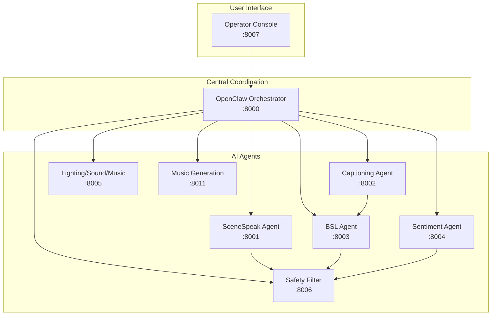
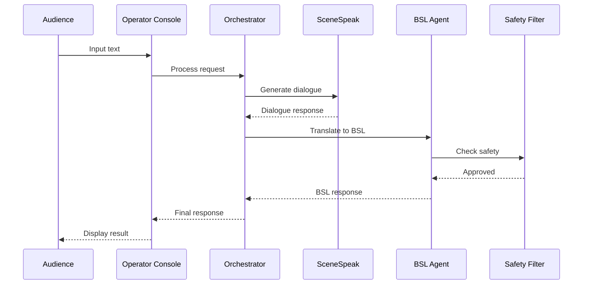

# System Architecture Overview

Project Chimera is an AI-powered live theatre platform that creates performances adapting in real-time to audience input. The system uses a microservices architecture with real-time communication between components.

## High-Level Architecture

## Component Overview

### OpenClaw Orchestrator (Port 8000)
Central coordination service that manages show flow, agent communication, and audience interaction. The orchestrator:
- Routes requests to appropriate agents
- Manages show state and transitions
- Coordinates real-time updates
- Handles audience input processing

### SceneSpeak Agent (Port 8001)
Generates dialogue for theatre performances using local LLM or GLM API. Features:
- Real-time dialogue generation
- Character voice consistency
- Scene-aware responses
- Configurable creativity settings

### Captioning Agent (Port 8002)
Transcribes audio to text in real-time using OpenAI Whisper. Provides:
- Live captioning for performances
- Multi-language support (future)
- High accuracy transcription
- Low latency processing

### BSL Agent (Port 8003)
Renders British Sign Language avatar using WebGL/Three.js with 107+ animations. Includes:
- Real-time BSL translation
- 3D avatar rendering
- Lip-sync engine
- Gesture queue management
- Performance optimizations (caching, streaming, worker pool)

### Sentiment Agent (Port 8004)
Analyzes audience sentiment from text using ML models. Features:
- Real-time sentiment analysis
- Emotion detection (happy, sad, angry, etc.)
- Audience engagement tracking
- Adaptive performance recommendations

### Lighting-Sound-Music (Port 8005)
Controls DMX lighting, sound playback, and background music generation. Provides:
- DMX lighting control
- Sound effect playback
- Background music management
- Scene-based presets

### Safety Filter (Port 8006)
Moderates content for safety and appropriateness. Ensures:
- Profanity filtering
- Content moderation
- Appropriateness checking
- Compliance with safety guidelines

### Operator Console (Port 8007)
Web-based dashboard for operators to control shows and monitor system status. Includes:
- Show control interface
- Real-time monitoring
- Service health dashboard
- Audience interaction panel

### Music Generation (Port 8011)
Generates background music for performances. Features:
- ML-based music generation
- Mood-based composition
- Real-time adaptation
- Loop-based playback

## Data Flow

1. **Input**: Audience input via Operator Console
2. **Processing**: Orchestrator routes requests to appropriate agents
3. **Generation**: Agents process (generate dialogue, translate to BSL, analyze sentiment)
4. **Filtering**: Safety filter validates all output
5. **Output**: Processed results sent back to Operator Console and audiences

## Technology Stack

- **Backend**: FastAPI (Python), async/await patterns
- **Frontend**: Vue.js, Three.js (for avatar), WebSocket
- **ML/AI**: OpenAI Whisper, GLM API, local LLM (Ollama)
- **Lighting**: DMX protocol, OpenDMX library
- **Orchestration**: Redis for state management
- **Monitoring**: Prometheus, Grafana
- **Containerization**: Docker, Docker Compose, Kubernetes
- **Testing**: Playwright (E2E), pytest (unit)

## Service Discovery

All services register with the orchestrator and expose health endpoints:

- `/health/live` - Liveness probe
- `/health/ready` - Readiness probe
- `/metrics` - Prometheus metrics
- `/docs` - API documentation (FastAPI auto-generated)
- `/openapi.json` - OpenAPI specification

## Next Steps

- See [Services](services.md) for detailed service documentation
- See [Architecture Decision Records](adr/) for technical decisions and rationale
- See [Data Flow](data-flow.md) for detailed request/response flows
