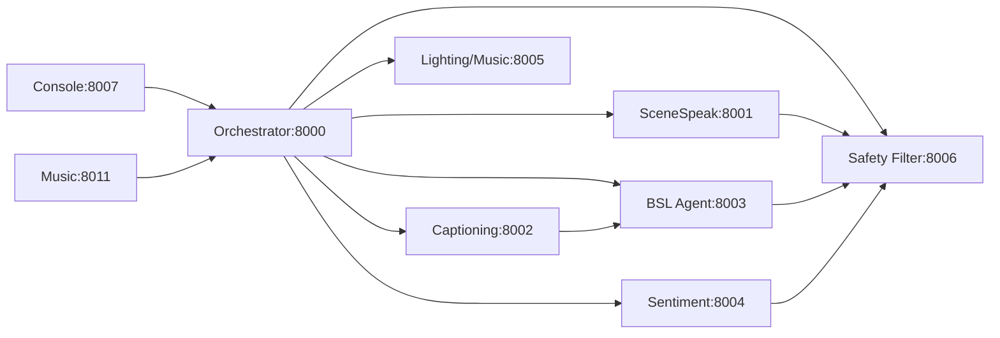

# Services Catalog

Complete catalog of all Project Chimera microservices with their purposes, ports, and dependencies.

## Service List

| Service | Port | Purpose | Dependencies |
|---------|------|---------|--------------|
| OpenClaw Orchestrator | 8000 | Central coordination, show flow, agent management | Redis, all agents |
| SceneSpeak Agent | 8001 | Dialogue generation using LLM | GLM API or Ollama |
| Captioning Agent | 8002 | Audio transcription to text | OpenAI Whisper |
| BSL Agent | 8003 | BSL translation and avatar rendering | WebGL/Three.js |
| Sentiment Agent | 8004 | Sentiment analysis from text | ML models |
| Lighting-Sound-Music | 8005 | Lighting, sound, music control | OpenDMX, sound files |
| Safety Filter | 8006 | Content moderation | SceneSpeak, Captioning |
| Operator Console | 8007 | Operator dashboard, show control | All services |
| Music Generation | 8011 | Background music generation | Music ML models |

## Service Dependencies

## Service Details

### OpenClaw Orchestrator (8000)
**Purpose**: Central coordination service

**Responsibilities**:
- Manage show state and flow
- Route requests to appropriate agents
- Coordinate real-time updates
- Handle audience input processing
- Aggregate agent responses

**Health Endpoints**:
- `GET /health/live` - Liveness check
- `GET /health/ready` - Readiness check with dependency status

**API Docs**: http://localhost:8000/docs

### SceneSpeak Agent (8001)
**Purpose**: Generate dialogue for performances

**Responsibilities**:
- Generate character dialogue
- Maintain character voice consistency
- Provide scene-aware responses
- Support configurable creativity settings

**Dependencies**:
- GLM API (external) or Ollama (local LLM)

**Configuration**: `GLM_API_KEY`, `LLM_MODEL`

### Captioning Agent (8002)
**Purpose**: Real-time audio transcription

**Responsibilities**:
- Transcribe audio to text
- Provide live captioning
- Support multiple audio formats
- Low latency processing

**Dependencies**:
- OpenAI Whisper model

**Configuration**: `WHISPER_MODEL`, `WHISPER_DEVICE`

### BSL Agent (8003)
**Purpose**: British Sign Language translation and avatar rendering

**Responsibilities**:
- Translate text to BSL
- Render 3D avatar using WebGL
- Play 107+ pre-built animations
- Handle lip-sync for speech
- Manage gesture queue

**Dependencies**:
- Three.js (frontend)
- NMM animation files

**Features**:
- Real-time rendering
- Recording (WebM/GIF)
- Timeline editor
- Camera controls
- Performance optimizations

### Sentiment Agent (8004)
**Purpose**: Analyze audience sentiment

**Responsibilities**:
- Analyze sentiment from text
- Detect emotions
- Track audience engagement
- Provide adaptive recommendations

**Dependencies**:
- ML models for sentiment analysis

**Configuration**: `SENTIMENT_MODEL`

### Lighting-Sound-Music (8005)
**Purpose**: Control lighting, sound, and music

**Responsibilities**:
- Control DMX lighting
- Play sound effects
- Manage background music
- Provide scene-based presets

**Dependencies**:
- OpenDMX library
- Sound file storage

**Configuration**: `DMX_PORT`, `SOUND_DIR`

### Safety Filter (8006)
**Purpose**: Content moderation

**Responsibilities**:
- Filter profanity
- Moderate content
- Check appropriateness
- Ensure safety compliance

**Dependencies**:
- SceneSpeak Agent outputs
- Captioning Agent outputs

**Configuration**: `SAFETY_LEVEL`

### Operator Console (8007)
**Purpose**: Operator dashboard and control

**Responsibilities**:
- Provide web-based UI
- Control shows
- Monitor service health
- Handle audience input

**Dependencies**:
- All services for status display

**Features**:
- Real-time dashboard
- Show controls
- Health monitoring
- BSL avatar viewer

### Music Generation (8011)
**Purpose**: Generate background music

**Responsibilities**:
- Generate mood-based music
- Provide real-time adaptation
- Support loop-based playback

**Dependencies**:
- ML models for music generation

**Configuration**: `MUSIC_MODEL`, `MOOD_PRESET`

## Health Check Endpoints

All services expose:

- `GET /health/live` - Returns `{"status": "alive"}` for liveness probes
- `GET /health/ready` - Returns detailed health status for readiness probes
- `GET /metrics` - Prometheus metrics
- `GET /docs` - API documentation (FastAPI auto-generated)

## Startup Order

Services should be started in this order:

1. **Infrastructure** (Redis, if using)
2. **Orchestrator** (port 8000)
3. **Agents** (can be started in parallel):
   - SceneSpeak (8001)
   - Captioning (8002)
   - BSL Agent (8003)
   - Sentiment (8004)
   - Lighting-Sound-Music (8005)
   - Safety Filter (8006)
   - Music Generation (8011)
4. **Operator Console** (8007)

## Configuration

Each service uses environment variables for configuration. See `.env.example` for available options.

Key environment variables:
- `PORT` - Service port (default varies by service)
- `LOG_LEVEL` - Logging level (DEBUG, INFO, WARNING, ERROR)
- `ENVIRONMENT` - Environment (development, staging, production)

Service-specific variables are listed in each service's section above.
