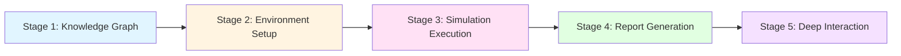
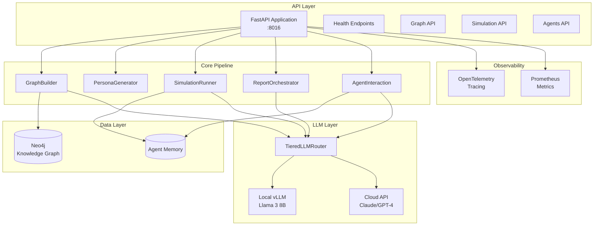
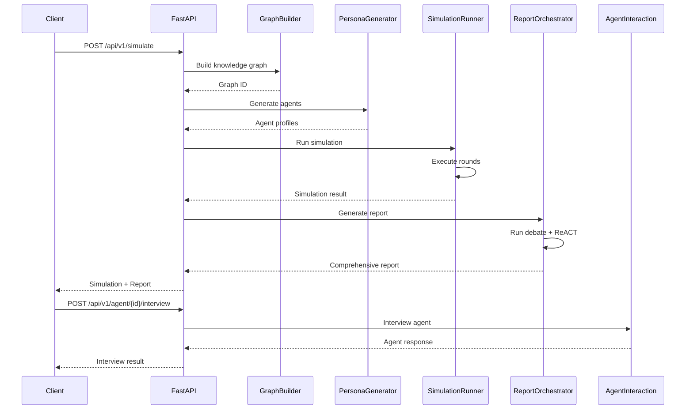
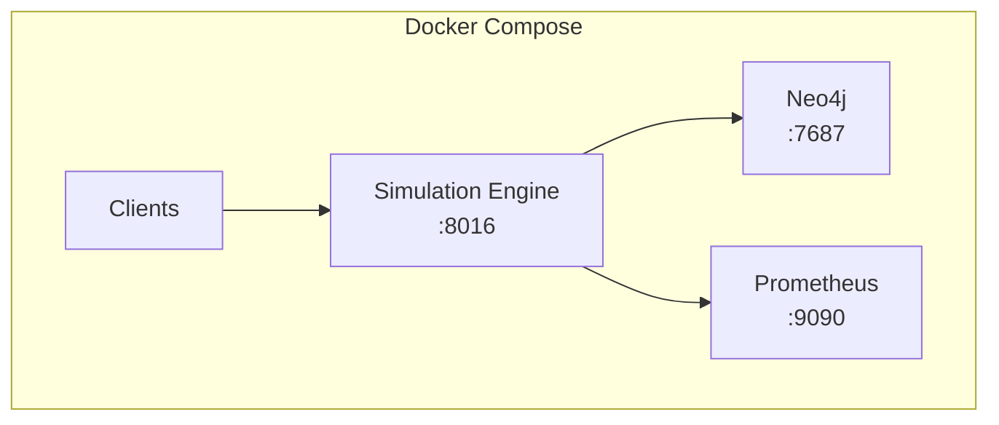
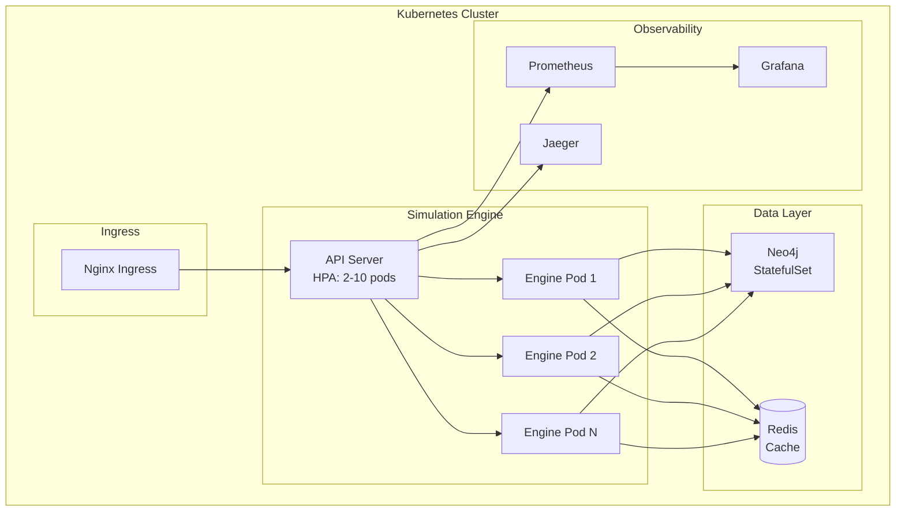
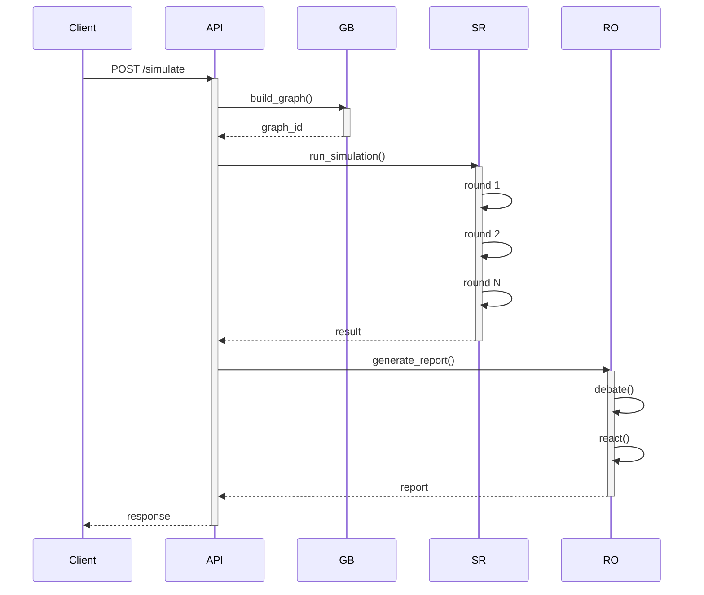

# Chimera Simulation Engine - System Design

## Overview

The Chimera Simulation Engine is a multi-agent swarm intelligence platform that enables "what-if" scenario testing for policy decisions, social dynamics, and organizational behavior analysis. It combines knowledge graph construction, diverse agent persona generation, parallel simulation execution, comprehensive report generation, and deep agent interaction into a unified five-stage pipeline.

## Five-Stage Pipeline

The simulation engine implements a sequential pipeline with five distinct stages:

### Stage 1: Knowledge Graph Construction

Extracts entities and relationships from seed documents using GraphRAG-inspired LLM-based extraction.

**Components:**
- `GraphBuilder` - Orchestrates graph construction workflow
- `LLMExtractor` - LLM-based entity and fact extraction
- `Neo4jClient` - Graph database operations and storage

**Process:**
1. Ingest seed documents (policy papers, research articles, scenario descriptions)
2. Extract entities with types (Person, Organization, Concept, Event)
3. Extract relationships between entities
4. Store in Neo4j with temporal metadata
5. Return graph ID for downstream stages

**Output:** Knowledge graph with entities, relationships, and temporal facts

**Key Files:**
- `graph/builder.py` - Main graph construction logic
- `graph/llm_extractor.py` - LLM-based extraction
- `graph/neo4j_client.py` - Database operations

### Stage 2: Environment Setup

Generates diverse agent personas with MBTI-based behavioral traits and demographic diversity.

**Components:**
- `PersonaGenerator` - Creates agent population with controlled diversity
- `AgentProfile` - Agent persona model with psychological traits

**Agent Attributes:**
- **MBTI Type**: 16 personality types influencing behavior
- **Demographics**: Age, gender, education, occupation, location, income
- **Behavioral Profile**: OCEAN traits (Openness, Conscientiousness, Extraversion, Agreeableness, Neuroticism)
- **Political Leaning**: 7-point spectrum from Far Left to Far Right
- **Information Sources**: Preferred media consumption patterns
- **Memory Capacity**: Limits for experience storage

**Output:** Population of agent profiles with unique characteristics

**Key Files:**
- `agents/persona.py` - Persona generation logic
- `agents/profile.py` - Agent profile data models

### Stage 3: Simulation Execution

Runs parallel agent simulation using tiered LLM routing for cost-conscious decision making.

**Components:**
- `SimulationRunner` - Orchestrates simulation rounds
- `TieredLLMRouter` - Cost-conscious LLM selection (95% local, 5% API)

**Process:**
1. Initialize agent population from Stage 2
2. For each simulation round:
   - Each agent observes environment and knowledge graph
   - Agent decides action using LLM (tiered routing)
   - Action logged to agent memory
3. Aggregate actions across all rounds
4. Generate summary statistics

**Tiered LLM Routing:**
- **95% Local vLLM** (Llama 3 8B) - ~$0 per simulation
- **5% API** (Claude/GPT-4) - ~$0.01 per simulation
- Dynamic routing based on complexity and context

**Output:** Simulation trace with all agent actions, timestamps, and outcomes

**Key Files:**
- `simulation/runner.py` - Main simulation orchestration
- `simulation/llm_router.py` - Tiered LLM routing logic

### Stage 4: Report Generation

Generates consensus reports through multi-agent debate and ReACT-pattern analysis.

**Components:**
- `ForumEngine` - Multi-agent debate system for consensus
- `ReACTReportAgent` - ReACT-pattern report generation
- `ReportOrchestrator` - Coordinates debate and synthesis

**Process:**
1. **ForumEngine Debate**:
   - Select diverse panel of agents from simulation
   - Run 3-round debate (Present → Critique → Refine)
   - Calculate consensus score and confidence interval

2. **ReACT Report Generation**:
   - Reason about simulation trace
   - Act by analyzing patterns and extracting insights
   - Observe results and refine analysis

3. **Synthesis**:
   - Combine forum consensus with ReACT analysis
   - Calculate overall confidence with statistical intervals
   - Generate comprehensive report

**Output:** Comprehensive report with findings, recommendations, confidence intervals

**Key Files:**
- `reporting/forum_engine.py` - Multi-agent debate
- `reporting/react_agent.py` - ReACT pattern implementation
- `reporting/orchestrator.py` - Report coordination

### Stage 5: Deep Interaction

Enables querying individual agents post-simulation to understand reasoning and decisions.

**Components:**
- `AgentInteraction` - Post-simulation agent queries
- `AgentMemory` - Agent experience storage and retrieval

**Capabilities:**
- Interview agents about their decisions and reasoning
- Analyze behavior patterns across simulation rounds
- Compare behaviors between multiple agents
- Retrieve agent memories with filtering

**Output:** Agent responses with context, memory snippets, and behavioral analysis

**Key Files:**
- `agents/interaction.py` - Agent interview logic
- `agents/memory.py` - Memory storage and retrieval

## System Architecture

## Technology Stack

| Component | Technology | Version | Purpose |
|-----------|-------------|---------|---------|
| **Web Framework** | FastAPI | 0.104+ | REST API with async support |
| **Graph Database** | Neo4j | 5.x | Knowledge graph storage |
| **LLM Routing** | Custom Tiered Router | - | Cost-conscious LLM selection |
| **Local LLM** | vLLM + Llama 3 | 8B | 95% of decisions, ~$0 cost |
| **Cloud LLM** | OpenAI, Anthropic | - | 5% of decisions, high quality |
| **Observability** | OpenTelemetry | - | Distributed tracing |
| **Metrics** | Prometheus | - | Performance monitoring |
| **Testing** | pytest, pytest-asyncio | - | Unit and integration tests |
| **Python** | CPython | 3.11+ | Runtime environment |

## Data Flow

### Request Flow

### Simulation Flow

1. **Client submits simulation request** to `/api/v1/simulate`
2. **API validates request** and queues simulation
3. **GraphBuilder processes documents** and creates knowledge graph
4. **PersonaGenerator generates** diverse agent population
5. **SimulationRunner executes** rounds with tiered LLM routing
6. **Actions logged** to agent memory for each round
7. **ReportOrchestrator generates** comprehensive report (if requested)
8. **Results returned** to client with simulation ID
9. **Client queries agents** via `/api/v1/agent/{id}/interview` for deep analysis

## Deployment Architecture

### Development (Docker Compose)

**Configuration:**
- Single simulation engine instance
- Local Neo4j for graph storage
- Local vLLM for LLM inference
- Prometheus for metrics collection

### Production (Kubernetes)

**Production Features:**
- **Horizontal Pod Autoscaler** (2-10 pods) for API servers
- **StatefulSet** for Neo4j with persistent volumes
- **Redis cache** for frequently accessed data
- **Prometheus + Grafana** for metrics and dashboards
- **Jaeger** for distributed tracing
- **Health checks** (`/health/live`, `/health/ready`)
- **Graceful shutdown** with request draining

## Cost Optimization

### Tiered LLM Routing Strategy

The simulation engine uses a sophisticated tiered routing system to minimize LLM costs while maintaining quality:

| Tier | Backend | Usage | Cost per 1K tokens |
|------|---------|-------|-------------------|
| **Tier 1** | Local vLLM (Llama 3 8B) | 95% | ~$0 |
| **Tier 2** | Cloud API (Claude/GPT-4) | 5% | ~$0.01 |

**Routing Logic:**
- Simple decisions → Local vLLM
- Complex reasoning → Cloud API
- Context-dependent routing based on:
  - Prompt complexity
  - Required accuracy
  - Agent personality traits
  - Simulation stage

**Expected Cost:**
- Small simulation (10 agents, 5 rounds): ~$0.01
- Medium simulation (100 agents, 20 rounds): ~$0.05
- Large simulation (1000 agents, 50 rounds): ~$0.20

## Observability

### Distributed Tracing (OpenTelemetry)

All simulation requests are traced end-to-end:

**Trace Spans:**
- `simulation_request` - Root span for entire simulation
- `graph_build` - Knowledge graph construction
- `persona_generation` - Agent population creation
- `simulation_round` - Individual simulation rounds
- `report_generation` - Report creation
- `agent_interview` - Post-simulation queries

### Metrics (Prometheus)

Key metrics tracked:

**Counter Metrics:**
- `simulations_total` - Total simulations started
- `simulation_actions_total` - Total agent actions
- `llm_requests_total` - LLM API calls

**Histogram Metrics:**
- `simulation_duration_seconds` - Simulation execution time
- `llm_token_usage` - Token consumption per backend
- `agent_decision_latency` - Time per agent decision

**Gauge Metrics:**
- `active_simulations` - Currently running simulations
- `llm_backend_health` - LLM backend availability

## Security Considerations

### API Security

- **CORS**: Configurable for production
- **Rate Limiting**: Per-client rate limits (planned)
- **Input Validation**: All requests validated with Pydantic
- **Output Sanitization**: Safety filter for agent responses

### Data Security

- **Neo4j Authentication**: Username/password required
- **Agent Memory**: In-memory storage, cleared after simulation
- **LLM API Keys**: Environment variables, never logged
- **Tracing**: Sensitive data redacted from traces

### Privacy

- **Agent Personas**: Synthetic, no real PII
- **Simulation Data**: Ephemeral, not persisted long-term
- **Audit Logs**: Access logging for compliance

## Performance Characteristics

### Scalability

| Metric | Value |
|--------|-------|
| **Max Agents** | 1,000 per simulation |
| **Max Rounds** | 100 per simulation |
| **Concurrent Simulations** | Limited by LLM backend capacity |
| **API Throughput** | ~100 requests/second (local vLLM) |

### Latency

| Operation | Expected Latency |
|-----------|------------------|
| **Health Check** | < 10ms |
| **Graph Build** | 1-5s (depends on document size) |
| **Persona Generation** | 100-500ms (for 100 agents) |
| **Simulation Round** | 1-10s (depends on agent count) |
| **Report Generation** | 5-30s (depends on complexity) |
| **Agent Interview** | 500ms-2s |

### Resource Requirements

**Minimum (Development):**
- CPU: 4 cores
- RAM: 8 GB
- Storage: 20 GB
- GPU: Optional (for local vLLM)

**Recommended (Production):**
- CPU: 16+ cores
- RAM: 32+ GB
- Storage: 100+ GB SSD
- GPU: NVIDIA GPU with 16+ GB VRAM (for local vLLM)

## Integration Points

### Chimera Ecosystem

The simulation engine integrates with other Chimera services:

**Sentiment Agent (:8004)**
- Receives real-time sentiment data
- Incorporates into knowledge graph
- Influences agent behavior

**Visual Core (:8014)**
- Processes video transcripts
- Extracts visual context
- Enhances knowledge graph

**OpenClaw Orchestrator (:8000)**
- Exposes simulation skill
- Task routing and coordination
- Unified API surface

### External Integrations

**LLM Providers:**
- OpenAI (GPT-4, GPT-3.5)
- Anthropic (Claude)
- Local vLLM (Llama family)

**Monitoring:**
- Prometheus (metrics)
- Jaeger (tracing)
- Grafana (visualization)

## Future Enhancements

**Phase 2:**
- [ ] Persistent simulation storage
- [ ] Simulation replay and analysis
- [ ] Advanced agent learning
- [ ] Multi-scenario comparison

**Phase 3:**
- [ ] Real-time simulation visualization
- [ ] Collaborative scenario editing
- [ ] Agent behavior export
- [ ] Custom agent creation API

**Phase 4:**
- [ ] Distributed simulation execution
- [ ] Multi-region deployment
- [ ] Advanced analytics pipeline
- [ ] Machine learning on simulation results

## Related Documentation

- [Component Reference](components.md) - Detailed component documentation
- [API Endpoints](../api/endpoints.md) - Complete API reference
- [Getting Started](../guides/getting-started.md) - Quick start guide
- [Deployment Guide](../guides/deployment.md) - Production deployment
