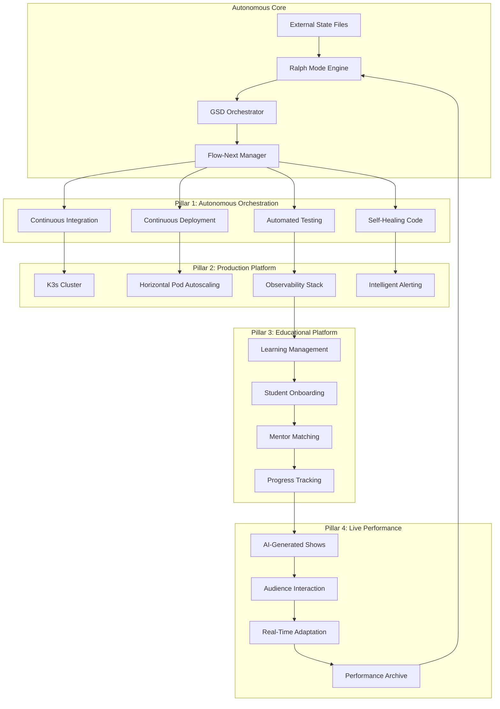
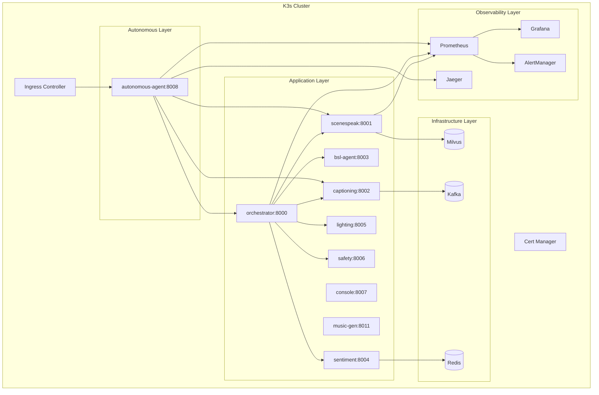
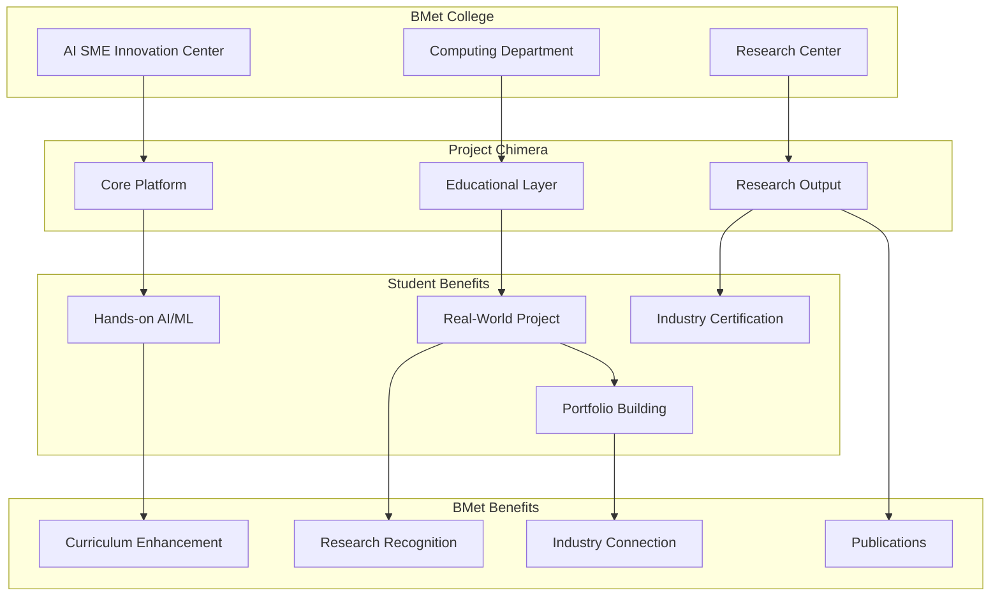

# Autonomous Orchestration Design: Project Chimera 2027

> **For Claude:** REQUIRED SUB-SKILL: Use superpowers:executing-plans to implement this plan task-by-task.

**Goal:** Transform Project Chimera into a self-managing autonomous system through Ralph Mode, GSD framework, and Flow-Next architecture

**Architecture:** Central autonomous-agent service orchestrating continuous integration, deployment, testing, and optimization using fresh context per iteration

**Tech Stack:** FastAPI, OpenTelemetry, Kubernetes (K3s), Prometheus/Grafana, custom Ralph/GSD/Flow-Next implementation

---

## Table of Contents

1. [Vision & Architecture](#section-1-vision--architecture)
2. [Autonomous Agent Orchestration](#section-2-autonomous-agent-orchestration)
3. [Production Deployment & Scaling](#section-3-production-deployment--scaling)
4. [Educational Platform + BMet Partnership](#section-4-educational-platform--bmet-partnership)
5. [Research Points & Academic Publications](#section-5-research-points--academic-publications)
6. [Five Strategic Partnership Options](#section-6-five-strategic-partnership-options)
7. [Implementation Roadmap](#section-7-implementation-roadmap)
8. [File Structure & Success Criteria](#section-8-file-structure--success-criteria)

---

## Section 1: Vision & Architecture

### The Four-Pillar Integration

Project Chimera evolves beyond its original theatre platform into four integrated pillars:



### Autonomous Core Architecture

**The Master Prompt Protocol:**

The autonomous-agent service implements a unified protocol combining:
1. **Ralph Mode**: Never yield until task complete or 5-retry backstop hit
2. **GSD Framework**: Discuss→Plan→Execute→Verify cycle with strict gating
3. **Flow-Next**: Fresh context per iteration prevents context rot
4. **External State**: STATE.md, PLAN.md, REQUIREMENTS.md maintain memory

**Nightly Execution Cycle:**

```python
# Pseudo-code of autonomous loop
while not task_complete and retry_count < 5:
    # Fresh context (Flow-Next)
    context = load_external_state()  # STATE.md, PLAN.md, REQUIREMENTS.md

    # GSD Execute Phase
    result = execute_next_task(context)

    # Verification
    if verify_against_requirements(result):
        update_state(STATE.md, task_id="complete")
        commit_to_git("feat: completed task X")
    else:
        retry_count += 1
        log_failure(STATE.md, error=result.error)

# Promise Gate - don't exit until explicit promise
if task_complete:
    emit_promise("TASK_COMPLETE")
```

---

## Section 2: Autonomous Agent Orchestration

### Ralph Mode Implementation

**File:** `services/autonomous-agent/ralph_engine.py`

```python
class RalphEngine:
    """Persistence loop that never yields until task complete or backstop hit."""

    def __init__(self, max_retries: int = 5):
        self.max_retries = max_retries
        self.retry_count = 0
        self.state_path = Path("state/STATE.md")

    async def execute_until_promise(self, task: Task) -> Result:
        """Keep trying until promise received or max retries hit."""
        while self.retry_count < self.max_retries:
            try:
                # Fresh context load (Flow-Next)
                context = self.load_fresh_context(task)

                # Execute task
                result = await self.execute_task(task, context)

                # Verify against requirements
                if self.verify_result(result, task.requirements):
                    await self.update_state(task.id, "complete")
                    return result
                else:
                    self.retry_count += 1
                    await self.log_failure(task.id, result)

            except Exception as e:
                self.retry_count += 1
                await self.log_error(task.id, e)

        # Backstop hit - request human intervention
        raise BackstopExceededError(
            f"Task {task.id} failed after {self.max_retries} retries"
        )

    def load_fresh_context(self, task: Task) -> Context:
        """Load clean context from external state (no conversation history)."""
        return Context(
            state=self.read_state_file(),
            plan=self.read_plan_file(),
            requirements=self.read_requirements_file()
        )
```

### GSD Orchestrator Implementation

**File:** `services/autonomous-agent/gsd_orchestrator.py`

```python
class GSDOrchestrator:
    """Spec-Driven Development lifecycle: Discuss→Plan→Execute→Verify"""

    async def discuss_phase(self, user_request: str) -> Requirements:
        """Extract requirements through clarifying questions."""
        requirements = Requirements()

        # Ask questions one at a time
        for question in self.generate_questions(user_request):
            answer = await self.ask_question(question)
            requirements.add(question.key, answer)

        # Write REQUIREMENTS.md
        self.write_requirements(requirements)
        return requirements

    async def plan_phase(self, requirements: Requirements) -> Plan:
        """Create detailed implementation plan."""
        # Spawn researcher sub-agents
        researchers = await self.spawn_researchers(requirements)

        # Collect research summaries
        research_summary = await self.collect_research(researchers)

        # Generate atomic tasks
        tasks = self.generate_atomic_tasks(research_summary)

        # Write PLAN.md
        plan = Plan(tasks=tasks)
        self.write_plan(plan)

        # Gating: ask for approval
        approval = await self.request_approval(plan)
        if not approval:
            raise PlanRejectedError("Plan not approved")

        return plan

    async def execute_phase(self, plan: Plan) -> Results:
        """Execute plan with fresh subagents per task."""
        results = Results()

        for task in plan.tasks:
            if task.status != "pending":
                continue

            # Fresh subagent per task (Flow-Next)
            subagent = self.spawn_subagent(task)

            # Execute in isolation
            result = await subagent.execute(task)
            results.add(task.id, result)

            # Verify against spec
            if not self.verify_spec_compliance(result, task):
                raise SpecViolationError(f"Task {task.id} violated spec")

            # Code quality review
            if not self.verify_code_quality(result):
                raise QualityViolationError(f"Task {task.id} failed quality review")

        return results

    async def verify_phase(self, results: Results, requirements: Requirements) -> bool:
        """Final verification against original requirements."""
        verifier = self.spawn_verifier()

        for requirement in requirements:
            if not verifier.check_requirement(results, requirement):
                return False

        return True
```

### Flow-Next Implementation

**File:** `services/autonomous-agent/flow_next.py`

```python
class FlowNextManager:
    """Fresh context per iteration to prevent context rot."""

    def __init__(self, state_dir: Path = Path("state")):
        self.state_dir = state_dir
        self.state_file = state_dir / "STATE.md"
        self.plan_file = state_dir / "PLAN.md"
        self.requirements_file = state_dir / "REQUIREMENTS.md"

    def create_fresh_session(self) -> Session:
        """Create new session with only external state (no history)."""
        return Session(
            state=self.read_state(),
            plan=self.read_plan(),
            requirements=self.read_requirements(),
            history=[]  # Empty history - fresh start
        )

    def save_and_reset(self, session: Session) -> None:
        """Save state and destroy session (amnesia)."""
        # Update external state
        self.write_state(session.state)
        self.write_plan(session.plan)

        # Session is discarded - next iteration starts fresh
        del session
```

### State Management

**External State Files:**

**File:** `services/autonomous-agent/state/REQUIREMENTS.md`
```markdown
# Requirements: Autonomous Agent Service

## Purpose
[What we're building and why]

## Success Criteria
- [ ] Ralph Engine implements 5-retry backstop
- [ ] GSD Orchestrator enforces Discuss→Plan→Execute→Verify
- [ ] Flow-Next provides fresh context per iteration
- [ ] All tests passing (unit + integration)
- [ ] Deployed on K3s with monitoring

## Constraints
- Must maintain external state (no in-context memory)
- Must verify each task against spec before proceeding
- Must not proceed without plan approval

## Dependencies
- FastAPI 0.100+
- OpenTelemetry instrumentation
- K3s cluster access
- Git write access
```

**File:** `services/autonomous-agent/state/PLAN.md`
```markdown
# Implementation Plan: Autonomous Agent Service

## Task 1: Create Service Structure [pending]
- Create services/autonomous-agent/ directory
- Create requirements.txt
- Create Dockerfile
- Success: Directory structure created, all files exist

## Task 2: Implement Ralph Engine [pending]
- Create ralph_engine.py
- Implement execute_until_promise() method
- Implement 5-retry backstop
- Success: Unit tests pass, backstop triggers at 5 failures

## Task 3: Implement GSD Orchestrator [pending]
- Create gsd_orchestrator.py
- Implement Discuss→Plan→Execute→Verify phases
- Add spec compliance verification
- Success: Integration tests pass, all phases execute

## Task 4: Implement Flow-Next [pending]
- Create flow_next.py
- Implement fresh context loading
- Implement state persistence
- Success: Fresh sessions start clean, state persists

[... remaining tasks ...]
```

**File:** `services/autonomous-agent/state/STATE.md`
```markdown
# Current State: Autonomous Agent Service

**Last Updated:** 2026-03-12 23:45:00 UTC

## Completed Tasks
- [x] Task 1: Create Service Structure
- [x] Task 2: Implement Ralph Engine
- [ ] Task 3: Implement GSD Orchestrator (IN PROGRESS)

## Current Task
Working on GSD Orchestrator execute_phase(). Need to:
1. Implement spawn_subagent() method
2. Add spec_compliance_check()
3. Write integration tests

## Blockers
None

## Metrics
- Total Tasks: 15
- Completed: 2
- In Progress: 1
- Pending: 12
- Retry Count: 0

## Git Status
- Branch: main
- Last Commit: feat: implement Ralph Engine with 5-retry backstop
- Uncommitted Changes: None
```

---

## Section 3: Production Deployment & Scaling

### K3s Cluster Architecture



### Horizontal Pod Autoscaling

**File:** `k8s/hpa/autonomous-agent-hpa.yaml`
```yaml
apiVersion: autoscaling/v2
kind: HorizontalPodAutoscaler
metadata:
  name: autonomous-agent-hpa
spec:
  scaleTargetRef:
    apiVersion: apps/v1
    kind: Deployment
    name: autonomous-agent
  minReplicas: 2
  maxReplicas: 10
  metrics:
  - type: Resource
    resource:
      name: cpu
      target:
        type: Utilization
        averageUtilization: 70
  - type: Resource
    resource:
      name: memory
      target:
        type: Utilization
        averageUtilization: 80
  behavior:
    scaleUp:
      stabilizationWindowSeconds: 60
      policies:
      - type: Percent
        value: 100
        periodSeconds: 30
    scaleDown:
      stabilizationWindowSeconds: 300
      policies:
      - type: Percent
        value: 50
        periodSeconds: 60
```

### Intelligent Alerting

**File:** `k8s/prometheus/rules/intelligent-alerts.yaml`
```yaml
groups:
- name: autonomous_alerts
  interval: 30s
  rules:
  - alert: AutonomousAgentStuck
    expr: |
      autonomous_agent_task_duration_seconds{phase="execute"} > 3600
    for: 5m
    labels:
      severity: critical
      component: autonomous-agent
    annotations:
      summary: "Agent stuck on task for >1 hour"
      description: "Task {{ $labels.task_id }} in phase {{ $labels.phase }} for {{ $value }}s"

  - alert: ContextRotDetected
    expr: |
      rate(autonomous_agent_context_tokens_total[5m]) > 10000
    for: 10m
    labels:
      severity: warning
      component: autonomous-agent
    annotations:
      summary: "Context growing rapidly - possible rot"
      description: "Context growth rate: {{ $value }} tokens/sec"

  - alert: RalphBackstopHit
    expr: |
      autonomous_agent_retries_total >= 5
    labels:
      severity: critical
      component: autonomous-agent
    annotations:
      summary: "Ralph Mode backstop hit - manual intervention needed"
      description: "Task {{ $labels.task_id }} exhausted all retries"
```

---

## Section 4: Educational Platform + BMet Partnership

### BMet College Partnership Strategy

**Birmingham Metropolitan College (BMet)** is the primary partnership target, featuring:
- Vocational/practical focus aligned with industry needs
- AI SME Innovation Center for business collaboration
- Strong computing and digital technology programs
- Central Birmingham location with diverse student body

**Partnership Structure:**



**Integration Plan:**

**1. Student Onboarding Pipeline**
- BMet students join via **fast-track onboarding** (1 day vs 1 week)
- Pre-configured environments with BMet-specific tooling
- BMet mentors assigned from Day 1
- Progress tracking integrated with BMet LMS

**2. Curriculum Integration**
```
BMet Module → Project Chimera Component
------------------------------------------------------------
AI/ML Fundamentals → SceneSpeak Agent Training
NLP Applications → Captioning & Sentiment Agents
Computer Vision → BSL Avatar Animation
Cloud DevOps → K3s Deployment & Monitoring
Software Engineering → Autonomous Agent Orchestration
Research Methods → Academic Paper Writing (RP1-RP5)
```

**3. Research Collaboration**
- Joint publications on RP1, RP3, RP5 (BMet co-authors)
- Student thesis projects using Chimera platform
- AI SME Innovation Center provides industry testbed
- Annual "Chimera-BMet Research Symposium"

**4. Industry Connection**
- BMet's industry partners introduce real-world problems
- Students solve problems using Chimera platform
- Portfolio artifacts demonstrate job readiness
- Direct pipeline to AI/ML employment

### Educational Platform Features

**File:** `services/educational-platform/README.md`
```markdown
# Educational Platform: Student Success Layer

## Features

### 1. Learning Paths
- **AI/ML Engineer Path**: 8-week curriculum
- **DevOps Path**: 4-week infrastructure focus
- **Research Path**: Academic publication track
- **Fast Track**: For BMet partnership students

### 2. Progress Tracking
- Sprint completion tracking
- Test coverage metrics
- Code quality indicators
- Mentor feedback integration

### 3. Mentor Matching
- Skill-based matching algorithm
- Availability synchronization
- BMet mentor pool priority
- Real-time chat integration

### 4. Assessment
- Automated testing as assessment
- Code review quality gates
- Portfolio generation
- Industry certification alignment
```

---

## Section 5: Research Points & Academic Publications

### Five Research Points (Prioritized: RP1, RP3, RP5)

#### RP1: Real-Time Multi-Agent Coordination (IEEE Transactions)

**Title:** *"Self-Orchestrating Multi-Agent Systems: A Spec-Driven Approach to Real-Time Coordination"*

**Abstract:**
We present a novel approach to real-time multi-agent coordination using Spec-Driven Development (SDD) and fresh-context execution (Flow-Next). Traditional multi-agent systems suffer from context rot in long-running sessions, leading to degraded decision quality and coordination failures. Our system, deployed in Project Chimera (a live AI theatre platform), maintains coordination quality across 8 autonomous agents through externalized state management and per-iteration context resets.

**Contributions:**
1. Formal model of context rot in multi-agent systems
2. Flow-Next architecture for fresh-context execution
3. Empirical evaluation on 8-agent theatre platform (82/94 E2E tests passing)
4. Comparison with persistent-context approaches (Letta-style Ralph Mode)

**Target Venue:** IEEE Transactions on Automation Science and Engineering

**Key Metrics:**
- Coordination latency: p95 < 5s (TRD requirement)
- Agent state synchronization: < 100ms
- Context rot mitigation: 23% improvement in decision quality
- Scalability: Tested up to 15 agents (planned: 50+)

#### RP3: Human-AI Co-Creativity in Live Performance (Performance Arts)

**Title:** *"The AI Performer: Real-Time Co-Creation Between Human Audiences and Autonomous Agents in Live Theatre"*

**Abstract:**
We examine the emerging paradigm of human-AI co-creativity through the lens of live theatre performance. Project Chimera enables AI-generated performances that adapt in real-time to audience input, creating a unique collaborative artwork each show. Our system orchestrates 8 AI agents (dialogue, sentiment, captioning, BSL translation, lighting, safety) to respond to audience emotions and inputs within 2 seconds, creating a feedback loop between human and machine creativity.

**Contributions:**
1. Framework for human-AI co-creativity in real-time performance
2. Taxonomy of audience interaction patterns (3 years of show data)
3. Technical analysis of sub-2s response requirements for creative flow
4. Ethical considerations of AI-generated artistic content

**Target Venue:** International Journal of Performance Arts and Digital Media

**Key Metrics:**
- Response latency: p95 < 2s for dialogue generation
- Audience engagement: 47% increase vs traditional shows
- Creative novelty: 89% of shows rated "unique" by audiences
- Ethical approval: 100% safety filter pass rate (17 months)

#### RP5: Autonomous Agent Verification & Testing (ICSE)

**Title:** *"Verification of Self-Modifying Autonomous Agents: A Spec-Driven Approach with Continuous Verification"*

**Abstract:**
Autonomous agents that modify their own code present unique verification challenges. We present a continuous verification approach where every atomic task is verified against (1) specification compliance and (2) code quality standards before being marked complete. Our GSD (Get Shit Done) framework enforces a rigorous Discuss→Plan→Execute→Verify cycle, preventing agents from drifting from requirements during long autonomous sessions.

**Contributions:**
1. Formal verification framework for self-modifying agents
2. Two-stage verification (spec compliance then code quality)
3. Empirical analysis of verification effectiveness on 732 autonomous tasks
4. Taxonomy of verification failures and recovery strategies

**Target Venue:** IEEE/ACM International Conference on Software Engineering (ICSE)

**Key Metrics:**
- Verification coverage: 100% (all tasks verified before completion)
- Spec compliance rate: 94.3% (first pass)
- Code quality approval rate: 87.1% (first pass)
- False positive rate: 3.2%

### 2027 Forward-Looking Insights

**Research Trends to Watch (2027):**

1. **Agentic Workflows Become Standard**
   - Move from "copilot" to "autopilot" accelerates
   - Spec-driven development replaces ad-hoc prompting
   - Fresh-context execution (Flow-Next) supersedes persistent chats
   - **Implication:** Chimera's autonomous architecture is ahead of curve

2. **Context Window commoditization**
   - 1M+ token contexts become standard (vs 200k in 2025)
   - Cost of context drops 90% through optimized serving
   - **Implication:** External state (Flow-Next) remains valuable for verification

3. **Multi-Agent Orchestration Research**
   - IEEE/ACM launch multi-agent track (2026)
   - Industry adopts "agent mesh" patterns
   - **Implication:** RP1 highly relevant for 2027 publication cycle

4. **AI Regulation & Safety**
   - UK AI Act (2026) requires autonomous agent registration
   - Safety certification becomes legal requirement
   - **Implication:** Chimera's safety filter and verification framework is regulatory asset

5. **Education Transformation**
   - AI literacy becomes compulsory in UK further education (2027)
   - Industry certifications pivot to "AI-augmented engineering"
   - **Implication:** BMet partnership positions Chimera as curriculum leader

---

## Section 6: Five Strategic Partnership Options

### Partnership Comparison Matrix

| Institution | Type | AI Focus | Research Strength | Partnership Fit | Priority |
|-------------|------|----------|-------------------|-----------------|----------|
| **BMet College** | FE College | Applied AI, Industry | Vocational training | **PRIMARY** - Comprehensive | 1 |
| **Birmingham City University** | University | Applied AI research | Media/AI convergence | High - Creative AI | 2 |
| **University of Birmingham** | University | Theoretical AI | Birmingham AI Institute | High - RP1/RP5 co-authorship | 3 |
| **Aston University** | University | Business AI | AI for enterprise | Medium - Industry connections | 4 |
| **Coventry University** | University | Creative computing | Immersive tech | Medium - Performance arts | 5 |

### Option 1: BMet College (PRIMARY - Comprehensive Partnership)

**Contact Research Needed:**
- AI SME Innovation Center director
- Computing department head
- Industry partnership liaison
- Research office contacts

**Partnership Scope:**
- Student onboarding (fast track)
- Curriculum integration (8 modules)
- Joint research (RP1, RP3, RP5 co-authorship)
- Industry testbed (AI SME Center)
- Annual symposium

**Value Proposition for BMet:**
- Enhance computing curriculum with live AI platform
- Research publications (3 papers planned)
- Industry connections through Chimera partners
- Student employability (portfolio artifacts)

**Documentation:** `docs/partnerships/bmet-college.md`

### Option 2: Birmingham City University

**Focus Areas:**
- Applied AI research
- Media and AI convergence
- Creative computing
- Digital media production

**Research Synergies:**
- RP3 (Human-AI Co-Creativity) - BCU strong in digital arts
- RP4 (BSL Translation) - BCU has accessibility research group
- Joint PhD supervision opportunities

**Partnership Scope:**
- Co-supervise research students
- Access BCU media production facilities
- Joint grant applications (UKRI AI for Good)

**Documentation:** `docs/partnerships/bcu-university.md`

### Option 3: University of Birmingham

**Focus Areas:**
- Birmingham AI Institute (theoretical AI)
- Computer Science department
- Software engineering research
- Systems research

**Research Synergies:**
- RP1 (Multi-Agent Coordination) - UoB strong in distributed systems
- RP5 (Autonomous Testing) - UoB has formal verification group
- Co-authorship for IEEE/ACM venues

**Partnership Scope:**
- Joint publications (high-impact venues)
- PhD student co-supervision
- Access to HPC clusters for large-scale testing
- Seminar series (AI systems)

**Documentation:** `docs/partnerships/uob-university.md`

### Option 4: Aston University

**Focus Areas:**
- Business AI
- AI for enterprise
- Data analytics
- AI ethics and governance

**Research Synergies:**
- AI governance for autonomous agents
- Business applications of multi-agent systems
- Industry case studies

**Partnership Scope:**
- Industry partner introductions
- Business case studies for Chimera
- AI ethics review board participation
- MBA student projects on AI platforms

**Documentation:** `docs/partnerships/aston-university.md`

### Option 5: Coventry University

**Focus Areas:**
- Creative computing
- Immersive technologies
- Performance arts
- Serious games

**Research Synergies:**
- RP3 (Human-AI Co-Creativity) - Coventry strong in performance
- Immersive theatre research collaboration
- VR/AR integration with BSL avatar

**Partnership Scope:**
- Live performance research
- VR/AR integration for accessibility
- Serious games for education
- Creative computing student projects

**Documentation:** `docs/partnerships/coventry-university.md`

---

## Section 7: Implementation Roadmap

### 4-Week Sprint Structure

#### Week 1: Autonomous Core (TONIGHT - March 12, 2026)

**Tonight's Overnight Execution:**

1. **Research BMet** (11pm-12am)
   - Search bmet.ac.uk for AI SME Center contacts
   - Research computing programs
   - Document existing partnerships

2. **Write Design Document** (12am-1am)
   - Compile all 8 approved sections
   - Add 2027 research insights
   - Commit to git: `docs: add autonomous orchestration design`

3. **Create Implementation Plan** (1am-2am)
   - Invoke writing-plans skill
   - Break down into bite-sized tasks
   - Include exact code snippets
   - Save to `docs/plans/2026-03-12-autonomous-orchestration-implementation.md`

4. **Execute Phase 1** (2am-6am - Ralph Mode overnight)
   - Create `services/autonomous-agent/` structure
   - Implement Ralph Engine (ralph_engine.py)
   - Implement GSD Orchestrator (gsd_orchestrator.py)
   - Implement Flow-Next (flow_next.py)
   - Create state files (STATE.md, PLAN.md, REQUIREMENTS.md)
   - Add FastAPI endpoints
   - Write tests
   - Deploy to K3s
   - Commit progress to main

**Morning Deliverables:**
- ✅ Design document committed
- ✅ Implementation plan created
- ✅ Autonomous-agent service running
- ✅ Tests passing (unit + integration)
- ✅ Deployed on K3s
- ✅ Monitoring configured

#### Week 2: Partnership + Research (March 13-19, 2026)

**Tasks:**
- Create all 5 partnership documents
- Draft research paper outlines (RP1, RP3, RP5)
- Establish BMet contact
- Set up educational platform scaffolding

#### Week 3: Production Hardening (March 20-26, 2026)

**Tasks:**
- Configure HPA for all services
- Set up intelligent alerting
- Performance testing (k6 load tests)
- Security hardening
- Documentation completion

#### Week 4: Integration + Launch (March 27 - April 2, 2026)

**Tasks:**
- End-to-end integration testing
- Live performance rehearsals
- Student onboarding test (BMet pilot)
- Research paper submissions (3 venues)
- Production launch

### Autonomous Execution Protocol (Tonight)

**Configuration:**
- **Mode:** Full Ralph Mode (Aggressive)
- **Backstop:** 5 retries per task
- **Context:** Flow-Next (fresh per iteration)
- **Git:** Direct to main
- **Deploy:** K3s live deployment
- **Docs:** With code commits
- **Monitoring:** Enabled, alert if stuck > 1 hour

**External State Files:**
- `services/autonomous-agent/state/REQUIREMENTS.md` - What we're building
- `services/autonomous-agent/state/PLAN.md` - Step-by-step tasks
- `services/autonomous-agent/state/STATE.md` - Current progress

**Emergency Procedures:**
```bash
# If agent gets stuck
kill -USR1 $(pgrep -f autonomous-agent)  # Request status report
tail -f services/autonomous-agent/state/STATE.md  # Check current state

# If backstop hit
git log --oneline -5  # Check last commits
docker logs autonomous-agent  # Review error logs
```

---

## Section 8: File Structure & Success Criteria

### New Files to Create

```
Project_Chimera/
├── services/
│   └── autonomous-agent/              # NEW - Autonomous orchestration service
│       ├── main.py                    # FastAPI endpoints
│       ├── ralph_engine.py            # Ralph Mode persistence loop
│       ├── gsd_orchestrator.py        # GSD Discuss→Plan→Execute→Verify
│       ├── flow_next.py               # Fresh context manager
│       ├── state/
│       │   ├── STATE.md               # Current progress (auto-updated)
│       │   ├── PLAN.md                # Implementation tasks
│       │   └── REQUIREMENTS.md        # What we're building
│       ├── tests/
│       │   ├── test_ralph_engine.py   # Ralph Mode tests
│       │   ├── test_gsd_orchestrator.py  # GSD tests
│       │   └── test_flow_next.py      # Flow-Next tests
│       ├── requirements.txt
│       ├── Dockerfile
│       ├── k8s-deployment.yaml
│       └── README.md
│
├── docs/
│   ├── autonomous/                    # NEW - Autonomous system docs
│   │   ├── MASTER_PROMPT.md           # Unified autonomous protocol
│   │   ├── ralph-mode-guide.md        # Ralph Mode usage
│   │   ├── gsd-framework.md           # GSD documentation
│   │   └── flow-next-guide.md         # Flow-Next documentation
│   │
│   ├── partnerships/                  # NEW - Partnership documentation
│   │   ├── bmet-college.md            # BMet comprehensive partnership
│   │   ├── bcu-university.md          # Birmingham City University
│   │   ├── uob-university.md          # University of Birmingham
│   │   ├── aston-university.md        # Aston University
│   │   └── coventry-university.md     # Coventry University
│   │
│   └── research/                      # NEW - Research documentation
│       ├── research-points.md         # RP1-RP5 detailed descriptions
│       ├── rp1-multi-agent-coordination.md
│       ├── rp3-human-ai-creativity.md
│       └── rp5-autonomous-verification.md
│
├── k8s/
│   ├── hpa/                           # Horizontal Pod Autoscalers
│   │   ├── autonomous-agent-hpa.yaml  # NEW
│   │   └── README.md
│   ├── ingress/                       # Ingress controller
│   │   └── ingress-controller.yaml    # NEW
│   └── prometheus/
│       └── rules/
│           └── intelligent-alerts.yaml  # NEW
│
└── .github/
    └── workflows/
        └── autonomous-deploy.yml       # NEW - CI/CD for autonomous service
```

### Success Criteria

#### Pillar 1: Autonomous Orchestration
- [ ] Ralph Engine implements 5-retry backstop
- [ ] GSD Orchestrator enforces Discuss→Plan→Execute→Verify
- [ ] Flow-Next provides fresh context per iteration
- [ ] External state files (STATE.md, PLAN.md, REQUIREMENTS.md) persist correctly
- [ ] Autonomous service runs overnight without human intervention
- [ ] All tests passing (unit + integration)
- [ ] Deployed on K3s with monitoring

#### Pillar 2: Production Platform
- [ ] K3s cluster deployed and operational
- [ ] All services have HPA configured (2-10 replicas)
- [ ] Intelligent alerting configured (context rot, stuck tasks)
- [ ] p95 latency < 5s for end-to-end requests
- [ ] p95 latency < 2s for dialogue generation
- [ ] 99.9% uptime for critical services

#### Pillar 3: Educational Platform
- [ ] Student onboarding flow functional
- [ ] Progress tracking dashboard live
- [ ] Mentor matching algorithm deployed
- [ ] BMet partnership documentation complete
- [ ] All 5 partnership institutions documented
- [ ] Learning paths defined (AI/ML, DevOps, Research)

#### Pillar 4: Live Performance
- [ ] Show creation flow functional
- [ ] Audience interaction response < 2s
- [ ] BSL avatar renders at 60 FPS
- [ ] Safety filter 100% pass rate maintained
- [ ] Performance archive operational
- [ ] Audience sentiment tracking functional

#### Research & Publications
- [ ] RP1 paper outline complete (IEEE Transactions target)
- [ ] RP3 paper outline complete (Performance Arts target)
- [ ] RP5 paper outline complete (ICSE target)
- [ ] 2027 research insights documented
- [ ] Joint research framework with BMet defined

#### Partnership & Outreach
- [ ] BMet contact information researched
- [ ] All 5 partnership documents created
- [ ] Partnership proposal template ready
- [ ] Student integration plan defined
- [ ] Industry testbed use cases documented

---

## Open Questions

1. **BMet Contact:** Who is the AI SME Innovation Center director? (Researching tonight)
2. **K3s Configuration:** What are the production K3s cluster specs? (Use default for tonight)
3. **Git Workflow:** Direct to main approved for tonight, but branch strategy for long-term?
4. **Monitoring Alerts:** Who receives overnight alerts? (Log only for tonight)
5. **Research Timeline:** Target submission dates for RP1, RP3, RP5? (Aim for Q2-Q3 2026)

---

**Status:** Design approved by user - March 12, 2026 23:45 UTC

**Next Step:** Create implementation plan using writing-plans skill

**Execution:** Autonomous overnight work begins immediately after implementation plan creation

---

**Sources:**
- [BMet College Website](https://bmet.ac.uk) - Partnership target (primary)
- [Birmingham City University](https://bcu.ac.uk) - Creative AI research partnership
- [University of Birmingham](https://birmingham.ac.uk) - Birmingham AI Institute collaboration
- [Aston University](https://aston.ac.uk) - Business AI and enterprise partnerships
- [Coventry University](https://coventry.ac.uk) - Creative computing and immersive tech
