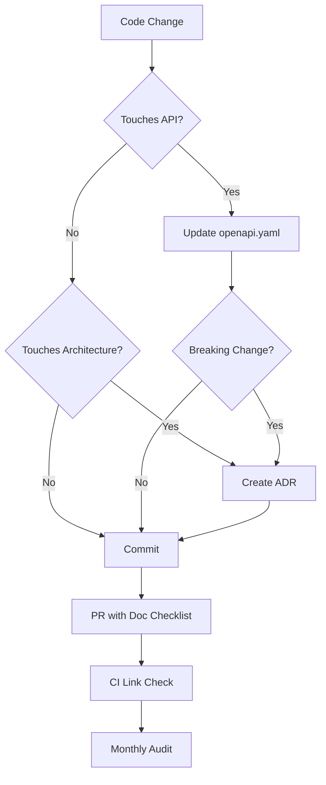

# Living Documentation Hub Design

> **For Claude:** REQUIRED SUB-SKILL: Use superpowers:executing-plans to implement this plan task-by-task.

**Goal:** Create a comprehensive, organized documentation system that stays in sync with code changes

**Architecture:** Centralized documentation structure with automated tooling for generation and validation

**Tech Stack:** Markdown, OpenAPI/Swagger, Mermaid/PlantUML, GitHub Actions

---

## Overview

Project Chimera needs a proper documentation system. Currently documentation is scattered (README.md in root, test-related files, no central structure). This design establishes a "Living Documentation Hub" that scales with the project and stays synchronized with code changes.

## Directory Structure

```
docs/
├── api/                          # API Documentation
│   ├── openapi.yaml              # OpenAPI spec (auto-generated from FastAPI)
│   ├── endpoints.md              # Human-readable endpoint catalog
│   └── schemas.md                # Data models and schemas
│
├── architecture/                 # System Architecture
│   ├── overview.md               # High-level system diagram
│   ├── services.md               # Service topology and interactions
│   ├── data-flow.md              # Request/response flows
│   ├── adr/                      # Architecture Decision Records
│   │   ├── 001-adopt-fastapi.md
│   │   ├── 002-webgl-avatar.md
│   │   └── .template.md          # ADR template
│   └── diagrams/                 # Architecture diagrams (Mermaid, PlantUML)
│
├── guides/                       # User Guides
│   ├── quick-start.md            # Get started in 5 minutes
│   ├── bsl-avatar/               # BSL Avatar specific guides
│   │   ├── playback-controls.md
│   │   ├── recording.md
│   │   ├── timeline-editor.md
│   │   └── animation-library.md
│   └── scenarios/                # Common use cases
│
├── development/                  # Developer Documentation
│   ├── setup.md                  # Local development setup
│   ├── testing.md                # Testing guide (unit, E2E)
│   ├── contributing.md           # Contribution guidelines
│   ├── code-style.md             # Coding standards
│   └── troubleshooting.md        # Common dev issues
│
├── operations/                   # Operations Documentation
│   ├── deployment.md             # Deployment procedures
│   ├── monitoring.md             # Observability, alerts
│   ├── runbooks/                 # Incident response runbooks
│   └── infrastructure/           # K8s, Docker, networking
│
└── index.md                      # Documentation landing page
```

## Content Strategy

### API Documentation (`docs/api/`)
- **openapi.yaml** - Auto-generated from FastAPI `/docs` endpoint, merged across all services
- **endpoints.md** - Human-readable catalog grouped by service with descriptions
- **schemas.md** - Request/response models with examples

### Architecture Documentation (`docs/architecture/`)
- **overview.md** - System diagram, components, data flow
- **services.md** - Each service's purpose, ports, dependencies
- **adr/** - Architecture Decision Records following standard template
- **diagrams/** - Mermaid/PlantUML diagrams versioned in git

### User Guides (`docs/guides/`)
- **quick-start.md** - "Hello World" in 5 minutes
- **bsl-avatar/** - Avatar feature guides (playback, recording, timeline, library)
- **scenarios/** - "How to translate text", "How to record signing", etc.

### Developer Documentation (`docs/development/`)
- **setup.md** - Local dev environment (Docker, deps, configs)
- **testing.md** - Unit vs E2E, running tests, coverage
- **contributing.md** - PR workflow, code review standards
- **code-style.md** - Python/JS conventions, formatting
- **troubleshooting.md** - Common dev issues & solutions

### Operations Documentation (`docs/operations/`)
- **deployment.md** - Docker Compose, K3s, CI/CD
- **monitoring.md** - Prometheus, Grafana, alerts, SLOs
- **runbooks/** - Incident response procedures
- **infrastructure/** - K8s manifests, networking, volumes

### Landing Page (`docs/index.md`)
- Navigation hub with quick links
- "Where do I start?" based on user type
- Recent updates / changelog

## Tools and Automation

### OpenAPI/Swagger Integration
- FastAPI auto-generates OpenAPI at `/docs` and `/openapi.json`
- CI script: `scripts/docs/generate-openapi.sh` pulls from each service
- Output: `docs/api/openapi.yaml` (merged spec for all services)

### Diagram Generation
- **Mermaid** for simple diagrams (embedded in Markdown)
- **PlantUML** for complex architecture diagrams
- CI verifies diagrams render correctly (prevent broken diagrams)

### Link Checking
- GitHub Action: `.github/workflows/check-links.yml`
- Runs daily, checks all internal and external links
- Fails CI if broken links found (with 404/timeout thresholds)

### ADR Template
- `docs/architecture/adr/.template.md` - Standard ADR format
- CI script: `scripts/docs/new-adr.sh <title>` creates numbered ADR
- Enforces: Status, Context, Decision, Consequences sections

### API Endpoint Catalog
- Script: `scripts/docs/generate-endpoint-catalog.py`
- Scans all services, extracts endpoint info
- Generates: `docs/api/endpoints.md` (grouped by service)

### Changelog Automation
- `.github/changelog-entries/` directory for change fragments
- CI combines fragments into `CHANGELOG.md` on release
- Format: `### Added`, `### Fixed`, `### Changed`

## Maintenance Workflow

### Pre-Commit Documentation Check
- Git hook: `scripts/docs/pre-commit-check.sh`
- Runs on every commit touching code
- Checks:
  - New API endpoints? → Prompt to update `docs/api/endpoints.md`
  - New service? → Prompt to add to `docs/architecture/services.md`
  - Breaking change? → Prompt to create ADR
- Non-blocking (warns only, can override with `--no-verify`)

### PR Documentation Checklist
- Template: `.github/PULL_REQUEST_TEMPLATE.md`
- Checklist items:
  - [ ] API docs updated (if endpoints changed)
  - [ ] ADR created (if architectural change)
  - [ ] User guide updated (if user-facing feature)
  - [ ] Runbooks updated (if operational change)
- Bot auto-comments checklist on PR open

### Monthly Documentation Audit
- GitHub Action: `.github/workflows/doc-audit.yml`
- Runs first Monday of each month
- Checks:
  - All services listed in docs actually exist
  - All endpoints in catalog are reachable
  - No stale references to deleted features
  - Code examples still work
- Creates issue if audit fails: `docs: Monthly audit - [date]`

### Documentation Debt Label
- GitHub label: `documentation-needed`
- Auto-applied by PR bot if:
  - Code change without doc update
  - New feature without user guide
  - Breaking change without migration guide
- Triage in weekly dev meeting

### Documentation Sprint
- Quarterly: 1-day focused doc sprint
- Clear backlog of `documentation-needed` issues
- Rotate ownership among team members
- Goal: Zero open `documentation-needed` tickets

## Implementation Priority

### Phase 1 - Foundation (Today)
1. Create directory structure
2. Add `docs/index.md` landing page
3. Create ADR template
4. Add link checker workflow
5. Create `docs/api/endpoints.md` from existing services

### Phase 2 - Core Content (This Week)
6. Generate `docs/api/openapi.yaml` from FastAPI
7. Write `docs/architecture/overview.md` with system diagram
8. Write `docs/architecture/services.md` catalog
9. Write `docs/guides/quick-start.md`
10. Write `docs/development/setup.md`

### Phase 3 - BSL Avatar Docs (This Week)
11. Write `docs/guides/bsl-avatar/playback-controls.md`
12. Write `docs/guides/bsl-avatar/recording.md`
13. Write `docs/guides/bsl-avatar/timeline-editor.md`
14. Write `docs/guides/bsl-avatar/animation-library.md`
15. Create ADR for BSL Avatar architecture

### Phase 4 - Operations & Dev (Next Week)
16. Write `docs/operations/deployment.md`
17. Write `docs/operations/monitoring.md`
18. Write `docs/development/testing.md`
19. Write `docs/development/contributing.md`
20. Add runbooks for common incidents

### Phase 5 - Automation & Polish (Ongoing)
21. Implement pre-commit doc check
22. Set up monthly audit workflow
23. Add PR template with doc checklist
24. Generate diagrams from code comments
25. Set up changelog automation

## Data Flow



## Error Handling

- **Link checker failures** → Create issue, don't block merge (with `--no-verify`)
- **OpenAPI generation failure** → Fail CI, requires manual fix
- **Diagram rendering error** → Fail CI, requires diagram fix
- **Pre-commit hook timeout** → Warn only, allow bypass

## Testing

- **Link check tests** - Verify all internal/external links resolve
- **Diagram rendering tests** - Ensure Mermaid/PlantUML compiles
- **OpenAPI validation** - Verify spec is valid OAS 3.0
- **Example code tests** - Run code snippets from docs to verify they work

## Success Criteria

1. All documentation organized in proper directory structure
2. OpenAPI spec auto-generated and validated
3. Link checker runs daily without failures
4. ADR template exists and is used for architectural decisions
5. BSL Avatar has complete user guides
6. Developer setup guide works for fresh contributors
7. Runbooks exist for common incidents
8. Pre-commit doc hook catches missing documentation
9. PR template enforces documentation checklist
10. Monthly audit runs and reports status

---

**Next Step:** Use `superpowers:executing-plans` to implement this plan task-by-task.
