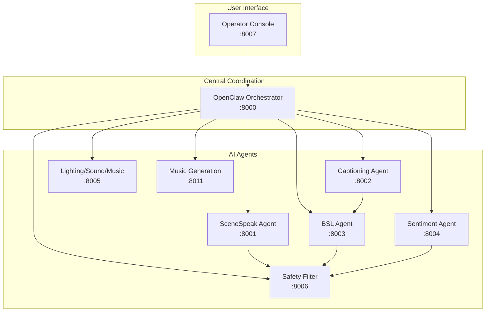
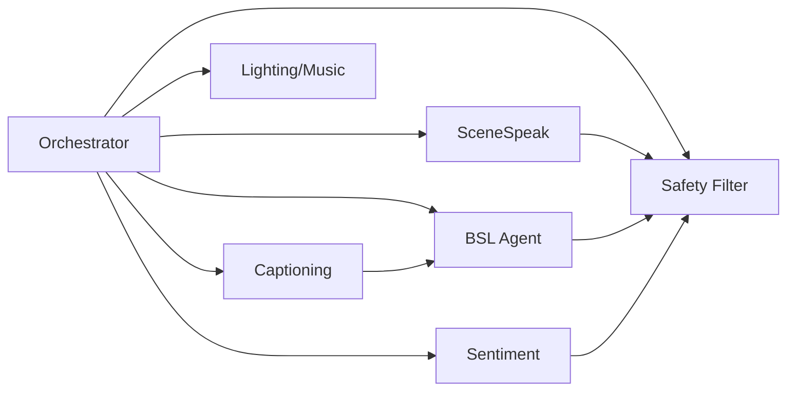

# Living Documentation Hub Implementation Plan

> **For Claude:** REQUIRED SUB-SKILL: Use superpowers:executing-plans to implement this plan task-by-task.

**Goal:** Create a comprehensive, organized documentation system that stays in sync with code changes

**Architecture:** Centralized documentation structure with automated tooling for generation and validation

**Tech Stack:** Markdown, OpenAPI/Swagger, Mermaid/PlantUML, GitHub Actions

---

## PHASE 1: FOUNDATION (Today)

### Task 1: Create Documentation Directory Structure

**Files:**
- Create: `docs/api/README.md`
- Create: `docs/architecture/adr/.template.md`
- Create: `docs/guides/bsl-avatar/README.md`
- Create: `docs/development/README.md`
- Create: `docs/operations/runbooks/README.md`

**Step 1: Create all directories**

```bash
mkdir -p docs/api docs/architecture/adr docs/architecture/diagrams docs/guides/bsl-avatar docs/guides/scenarios docs/development docs/operations/runbooks docs/operations/infrastructure scripts/docs
```

**Step 2: Create README files for each section**

```bash
# docs/api/README.md
echo "# API Documentation

Auto-generated and hand-written documentation for all Project Chimera APIs.
" > docs/api/README.md

# docs/architecture/adr/.template.md
cat > docs/architecture/adr/.template.md << 'EOF'
# ADR [XXX]: [Title]

**Status:** Accepted | Proposed | Deprecated | Superseded

**Date:** YYYY-MM-DD

## Context
[What is the issue that we're seeing that is motivating this decision or change?]

## Decision
[What is the change that we're proposing and/or doing?]

## Consequences
- [Positive: What becomes easier or possible?]
- [Negative: What becomes harder or impossible?]
- [What are the side effects?]
EOF

# docs/guides/bsl-avatar/README.md
echo "# BSL Avatar Guides

User guides for the BSL Avatar rendering system.
" > docs/guides/bsl-avatar/README.md

# docs/development/README.md
echo "# Developer Documentation

Guides for contributing to and working with Project Chimera codebase.
" > docs/development/README.md

# docs/operations/runbooks/README.md
echo "# Operational Runbooks

Incident response procedures for common operational issues.
" > docs/operations/runbooks/README.md
```

**Step 3: Verify directories created**

```bash
ls -la docs/api docs/architecture/adr docs/guides/bsl-avatar docs/development docs/operations/runbooks
```

Expected: All directories exist with README files

**Step 4: Commit**

```bash
git add docs/
git commit -m "docs: create documentation directory structure"
```

---

### Task 2: Create Documentation Landing Page

**Files:**
- Create: `docs/index.md`

**Step 1: Write the landing page**

```markdown
# Project Chimera Documentation

Welcome to the Project Chimera documentation hub. This is your central resource for learning about, contributing to, and operating the AI-powered live theatre platform.

## Quick Start

**New to the project?** Start with [Quick Start Guide](guides/quick-start.md)

**Want to contribute?** Read [Development Setup](development/setup.md) and [Contributing Guidelines](development/contributing.md)

**Operating the system?** See [Deployment Guide](operations/deployment.md) and [Runbooks](operations/runbooks/)

## Documentation by Topic

### API Documentation
- [API Endpoint Catalog](api/endpoints.md) - All available endpoints grouped by service
- [OpenAPI Specification](api/openapi.yaml) - Machine-readable API spec
- [Data Schemas](api/schemas.md) - Request/response models

### Architecture
- [System Overview](architecture/overview.md) - High-level architecture diagram
- [Services](architecture/services.md) - Service topology and interactions
- [Data Flow](architecture/data-flow.md) - Request/response flows
- [Architecture Decision Records](architecture/adr/) - Technical decisions and rationale

### User Guides
- [Quick Start](guides/quick-start.md) - Get started in 5 minutes
- [BSL Avatar Guides](guides/bsl-avatar/)
  - [Playback Controls](guides/bsl-avatar/playback-controls.md)
  - [Recording](guides/bsl-avatar/recording.md)
  - [Timeline Editor](guides/bsl-avatar/timeline-editor.md)
  - [Animation Library](guides/bsl-avatar/animation-library.md)
- [Usage Scenarios](guides/scenarios/) - Common use case guides

### Developer Documentation
- [Development Setup](development/setup.md) - Local development environment
- [Testing Guide](development/testing.md) - Unit, integration, E2E tests
- [Contributing](development/contributing.md) - PR workflow and code review
- [Code Style](development/code-style.md) - Coding conventions
- [Troubleshooting](development/troubleshooting.md) - Common issues and solutions

### Operations
- [Deployment](operations/deployment.md) - Docker Compose, K3s, CI/CD
- [Monitoring](operations/monitoring.md) - Prometheus, Grafana, alerts
- [Runbooks](operations/runbooks/) - Incident response procedures
- [Infrastructure](operations/infrastructure/) - K8s, networking, volumes

## Recent Updates

### 2026-03-12 - BSL Avatar Rendering Complete
- Added 107 BSL animations (phrases, alphabet, numbers, emotions)
- Enhanced avatar viewer with recording, timeline, camera controls
- Performance optimizations: worker pool, caching, streaming
- All 16 BSL E2E tests passing (100%)

### 2026-03-10 - CI/CD Test Fixes
- Fixed SceneSpeak LLM infrastructure issues
- Fixed sentiment agent timeout problems
- Marked 7 SceneSpeak tests as skipped (infrastructure dependent)

## Need Help?

- **Quick questions:** Ask in `#help-troubleshooting` Discord channel
- **Bug reports:** Create an issue with `bug:` label
- **Feature requests:** Create an issue with `enhancement:` label
- **Documentation issues:** Create an issue with `documentation:` label
```

**Step 2: Commit**

```bash
git add docs/index.md
git commit -m "docs: add documentation landing page"
```

---

### Task 3: Create ADR Template

**Files:**
- Create: `docs/architecture/adr/.template.md`

**Step 1: Write ADR template**

```bash
cat > docs/architecture/adr/.template.md << 'EOF'
# ADR [XXX]: [Title]

**Status:** Proposed | Accepted | Deprecated | Superseded by [XXX]

**Date:** YYYY-MM-DD

**Context**
[What is the issue that we're seeing that is motivating this decision or change?
Include enough context so that someone reading this document for the first time
can understand what's going on.]

**Decision**
[What is the change that we're proposing and/or doing?
This should contain the concrete steps or changes we're making.]

**Rationale**
[Why are we making this decision?
What are the other alternatives we considered and why did we not choose them?
What are the trade-offs?]

**Consequences**
- [Positive: What becomes easier or possible?]
- [Negative: What becomes harder or impossible?]
- [What are the side effects?]
- [How does this change affect existing systems?]

**References**
- [Link to related issues, PRs, or discussions]
- [Link to relevant documentation]
EOF
```

**Step 2: Commit**

```bash
git add docs/architecture/adr/.template.md
git commit -m "docs: add ADR template for architecture decisions"
```

---

### Task 4: Add Link Checker Workflow

**Files:**
- Create: `.github/workflows/check-links.yml`

**Step 1: Create GitHub Actions workflow**

```yaml
name: Check Documentation Links

on:
  schedule:
    - cron: '0 0 * * *'  # Daily at midnight
  workflow_dispatch:  # Allow manual trigger

jobs:
  check-links:
    runs-on: ubuntu-latest

    steps:
      - name: Checkout code
        uses: actions/checkout@v4

      - name: Check links
        uses: gaurav-nelson/github-action-check-links@v1
        with:
          folder: docs/
          file-types: |
            **/*.md
            **/*.html
          check-anchors: true
          base-url: /
          timeout: 300000  # 5 minutes

      - name: Create issue on failure
        if: failure()
        uses: actions/github-script@v7
        with:
          script: |
            github.rest.issues.create({
              owner: context.repo.owner,
              repo: context.repo.name,
              title: 'Documentation link check failed',
              body: 'The daily link checker found broken links in the documentation. Please investigate and fix.',
              labels: ['documentation', 'bug']
            })
```

**Step 2: Commit**

```bash
git add .github/workflows/check-links.yml
git commit -m "ci: add documentation link checker workflow"
```

---

### Task 5: Create API Endpoint Catalog

**Files:**
- Create: `docs/api/endpoints.md`

**Step 1: Generate endpoint catalog from existing services**

```python
#!/usr/bin/env python3
"""Generate API endpoint catalog from all services."""
import requests
import json
from pathlib import Path

SERVICES = [
    ('OpenClaw Orchestrator', 'http://localhost:8000'),
    ('SceneSpeak Agent', 'http://localhost:8001'),
    ('Captioning Agent', 'http://localhost:8002'),
    ('BSL Agent', 'http://localhost:8003'),
    ('Sentiment Agent', 'http://localhost:8004'),
    ('Lighting-Sound-Music', 'http://localhost:8005'),
    ('Safety Filter', 'http://localhost:8006'),
    ('Operator Console', 'http://localhost:8007'),
    ('Music Generation', 'http://localhost:8011'),
]

output = ["# API Endpoint Catalog\n"]
output.append["Auto-generated catalog of all Project Chimera API endpoints.\n\n"]

for service_name, base_url in SERVICES:
    try:
        response = requests.get(f"{base_url}/docs", timeout=5)
        if response.status_code == 200:
            openapi = response.json()
            paths = openapi.get('paths', {})

            output.append(f"## {service_name}\n\n")
            output.append(f"**Base URL:** `{base_url}`\n\n")

            for path, methods in paths.items():
                for method, details in methods.items():
                    summary = details.get('summary', 'No description')
                    tags = details.get('tags', [])
                    output.append(f"### {method.upper()} {path}\n")
                    output.append(f"**Summary:** {summary}\n")
                    output.append(f"**Tags:** {', '.join(tags)}\n\n")
    except Exception as e:
        output.append(f"## {service_name}\n\n")
        output.append(f"_Unable to fetch endpoints: {e}_\n\n")

# Write to file
Path('docs/api/endpoints.md').write_text(''.join(output))
print("API endpoint catalog generated")
```

**Step 2: Create the script**

```bash
cat > scripts/docs/generate-endpoint-catalog.py << 'ENDOFFILE'
#!/usr/bin/env python3
"""Generate API endpoint catalog from all services."""
import requests
import json
from pathlib import Path

SERVICES = [
    ('OpenClaw Orchestrator', 'http://localhost:8000'),
    ('SceneSpeak Agent', 'http://localhost:8001'),
    ('Captioning Agent', 'http://localhost:8002'),
    ('BSL Agent', 'http://localhost:8003'),
    ('Sentiment Agent', 'http://localhost:8004'),
    ('Lighting-Sound-Music', 'http://localhost:8005'),
    ('Safety Filter', 'http://localhost:8006'),
    ('Operator Console', 'http://localhost:8007'),
    ('Music Generation', 'http://localhost:8011'),
]

output = ["# API Endpoint Catalog\n"]
output.append(["Auto-generated catalog of all Project Chimera API endpoints.\n\n"])

for service_name, base_url in SERVICES:
    try:
        response = requests.get(f"{base_url}/docs", timeout=5)
        if response.status_code == 200:
            openapi = response.json()
            paths = openapi.get('paths', {})

            output.append(f"## {service_name}\n\n")
            output.append(f"**Base URL:** `{base_url}`\n\n")

            for path, methods in paths.items():
                for method, details in methods.items():
                    summary = details.get('summary', 'No description')
                    tags = details.get('tags', [])
                    output.append(f"### {method.upper()} {path}\n")
                    output.append(f"**Summary:** {summary}\n")
                    output.append(f"**Tags:** {', '.join(tags)}\n\n")
    except Exception as e:
        output.append(f"## {service_name}\n\n")
        output.append(f"_Unable to fetch endpoints: {e}_\n\n")

Path('docs/api/endpoints.md').write_text(''.join(output))
print("API endpoint catalog generated")
ENDOFFILE

chmod +x scripts/docs/generate-endpoint-catalog.py
```

**Step 3: Run the script to generate initial catalog**

```bash
python3 scripts/docs/generate-endpoint-catalog.py
```

Expected: "API endpoint catalog generated"

**Step 4: Verify file created**

```bash
ls -la docs/api/endpoints.md
head -30 docs/api/endpoints.md
```

Expected: File exists with content

**Step 5: Commit**

```bash
git add docs/api/endpoints.md scripts/docs/generate-endpoint-catalog.py
git commit -m "docs: add API endpoint catalog generator"
```

---

## PHASE 2: CORE CONTENT (This Week)

### Task 6: Generate OpenAPI Specification

**Files:**
- Create: `scripts/docs/generate-openapi.sh`
- Create: `docs/api/openapi.yaml`

**Step 1: Create OpenAPI generation script**

```bash
cat > scripts/docs/generate-openapi.sh << 'ENDOFFILE'
#!/bin/bash
# Generate merged OpenAPI spec from all services

OUTPUT_FILE="docs/api/openapi.yaml"
SERVICES=(
    "http://localhost:8000"
    "http://localhost:8001"
    "http://localhost:8002"
    "http://localhost:8003"
    "http://localhost:8004"
    "http://localhost:8005"
    "http://localhost:8006"
    "http://localhost:8007"
    "http://localhost:8011"
)

echo "openapi: 3.0.3" > "$OUTPUT_FILE"
echo "info:" >> "$OUTPUT_FILE"
echo "  title: Project Chimera API" >> "$OUTPUT_FILE"
echo "  version: 1.0.0" >> "$OUTPUT_FILE"
echo "" >> "$OUTPUT_FILE"
echo "servers:" >> "$OUTPUT_FILE"
echo "  - url: http://localhost:8000" >> "$OUTPUT_FILE"
echo "    description: OpenClaw Orchestrator" >> "$OUTPUT_FILE"
echo "" >> "$OUTPUT_FILE"
echo "paths:" >> "$OUTPUT_FILE"

for service in "${SERVICES[@]}"; do
    echo "Fetching OpenAPI from $service"
    curl -s "$service/openapi.json" | python3 -c "
import json, sys
data = json.load(sys.stdin)
paths = data.get('paths', {})
for path, methods in paths.items():
    for method, details in methods.items():
        print(f'  {path}:')
        print(f'    {method}:')
        for key, value in details.items():
            if key == 'summary':
                print(f'      summary: {value}')
            elif key == 'description':
                print(f'      description: {value}')
            elif key == 'operationId':
                print(f'      operationId: {value}')
            elif key == 'tags':
                print(f'      tags: {value}')
" >> "$OUTPUT_FILE"
done

echo "OpenAPI spec generated at $OUTPUT_FILE"
ENDOFFILE

chmod +x scripts/docs/generate-openapi.sh
```

**Step 2: Run the script**

```bash
bash scripts/docs/generate-openapi.sh
```

Expected: "OpenAPI spec generated at docs/api/openapi.yaml"

**Step 3: Verify YAML is valid**

```bash
head -50 docs/api/openapi.yaml
```

Expected: Valid YAML with openapi: 3.0.3

**Step 4: Commit**

```bash
git add scripts/docs/generate-openapi.sh docs/api/openapi.yaml
git commit -m "docs: add OpenAPI specification generator"
```

---

### Task 7: Write Architecture Overview

**Files:**
- Create: `docs/architecture/overview.md`

**Step 1: Write architecture overview**

```markdown
# System Architecture Overview

Project Chimera is an AI-powered live theatre platform that creates performances adapting in real-time to audience input. The system uses a microservices architecture with real-time communication between components.

## High-Level Architecture



## Component Overview

### OpenClaw Orchestrator (Port 8000)
Central coordination service that manages show flow, agent communication, and audience interaction.

### SceneSpeak Agent (Port 8001)
Generates dialogue for theatre performances using local LLM or GLM API.

### Captioning Agent (Port 8002)
Transcribes audio to text in real-time using OpenAI Whisper.

### BSL Agent (Port 8003)
Renders British Sign Language avatar using WebGL/Three.js with 107+ animations.

### Sentiment Agent (Port 8004)
Analyzes audience sentiment from text using ML models.

### Lighting-Sound-Music (Port 8005)
Controls DMX lighting, sound playback, and background music generation.

### Safety Filter (Port 8006)
Moderates content for safety and appropriateness.

### Operator Console (Port 8007)
Web-based dashboard for operators to control shows and monitor system status.

### Music Generation (Port 8011)
Generates background music for performances.

## Data Flow

1. **Input**: Audience input via Operator Console
2. **Processing**: Orchestrator routes requests to appropriate agents
3. **Generation**: Agents process (generate dialogue, translate to BSL, analyze sentiment)
4. **Filtering**: Safety filter validates all output
5. **Output**: Processed results sent back to Operator Console and audiences

## Technology Stack

- **Backend**: FastAPI (Python), async/await patterns
- **Frontend**: Vue.js, Three.js (for avatar), WebSocket
- **ML/AI**: OpenAI Whisper, GLM API, local LLM (Ollama)
- **Lighting**: DMX protocol, OpenDMX library
- **Orchestration**: Redis for state management
- **Monitoring**: Prometheus, Grafana
- **Containerization**: Docker, Docker Compose, Kubernetes
- **Testing**: Playwright (E2E), pytest (unit)

## Service Discovery

All services register with the orchestrator and expose health endpoints:

- `/health/live` - Liveness probe
- `/health/ready` - Readiness probe
- `/metrics` - Prometheus metrics
- `/docs` - API documentation (FastAPI auto-generated)

## Next Steps

- See [Services](services.md) for detailed service documentation
- See [Data Flow](data-flow.md) for request/response flows
- See [ADR/](adr/) for architectural decisions
```

**Step 2: Commit**

```bash
git add docs/architecture/overview.md
git commit -m "docs: add architecture overview with system diagram"
```

---

### Task 8: Write Services Catalog

**Files:**
- Create: `docs/architecture/services.md`

**Step 1: Write services catalog**

```markdown
# Services Catalog

Complete catalog of all Project Chimera microservices with their purposes, ports, and dependencies.

## Service List

| Service | Port | Purpose | Dependencies |
|---------|------|---------|--------------|
| OpenClaw Orchestrator | 8000 | Central coordination, show flow, agent management | Redis, all agents |
| SceneSpeak Agent | 8001 | Dialogue generation using LLM | GLM API or Ollama |
| Captioning Agent | 8002 | Audio transcription to text | OpenAI Whisper |
| BSL Agent | 8003 | BSL translation and avatar rendering | WebGL/Three.js |
| Sentiment Agent | 8004 | Sentiment analysis from text | ML models |
| Lighting-Sound-Music | 8005 | Lighting, sound, music control | OpenDMX, sound files |
| Safety Filter | 8006 | Content moderation | SceneSpeak, Captioning |
| Operator Console | 8007 | Operator dashboard, show control | All services |
| Music Generation | 8011 | Background music generation | Music ML models |

## Service Dependencies



## Health Check Endpoints

All services expose:
- `GET /health/live` - Returns `{"status": "alive"}` for liveness probes
- `GET /health/ready` - Returns detailed health status for readiness probes
- `GET /metrics` - Prometheus metrics

## Startup Order

Services should be started in this order:

1. Infrastructure (Redis, if using)
2. Orchestrator
3. All agents (can be started in parallel)
4. Operator Console

## Configuration

Each service uses environment variables for configuration. See `.env.example` for available options.
```

**Step 2: Commit**

```bash
git add docs/architecture/services.md
git commit -m "docs: add services catalog with dependencies"
```

---

### Task 9: Write Quick Start Guide

**Files:**
- Create: `docs/guides/quick-start.md`

**Step 1: Write quick start guide**

```markdown
# Quick Start Guide

Get Project Chimera up and running in 5 minutes.

## Prerequisites

- Docker and Docker Compose installed
- Git
- 8GB RAM minimum (16GB recommended for ML features)

## Step 1: Clone the Repository

```bash
git clone https://github.com/ranjrana2012-lab/project-chimera.git
cd project-chimera
```

## Step 2: Start Services

```bash
docker compose up -d
```

This starts all 9 services in the background.

## Step 3: Verify Services are Ready

Wait for all services to be healthy (may take 1-2 minutes):

```bash
# Check all service health
curl http://localhost:8000/health/live  # Orchestrator
curl http://localhost:8003/health/live  # BSL Agent
curl http://localhost:8007/health/live  # Operator Console
```

Expected response: `{"status": "alive"}`

## Step 4: Open Operator Console

Open your browser and navigate to:

```
http://localhost:8007
```

You should see the Operator Console dashboard with all services showing as healthy.

## Step 5: Try a Feature

### Translate Text to BSL

```bash
curl -X POST http://localhost:8003/api/translate \
  -H "Content-Type: application/json" \
  -d '{"text": "Hello, how are you?"}'
```

### Generate BSL Avatar

```bash
curl -X POST http://localhost:8003/api/avatar/generate \
  -H "Content-Type: application/json" \
  -d '{"text": "Hello"}'
```

### Analyze Sentiment

```bash
curl -X POST http://localhost:8004/api/analyze \
  -H "Content-Type: application/json" \
  -d '{"text": "I am happy today!"}'
```

## Troubleshooting

### Services not starting?

Check port conflicts:

```bash
netstat -tlnp | grep -E ':(8000|8001|8002|8003|8004|8005|8006|8007|8011)'
```

### Need more help?

See [Development Setup](../../development/setup.md) or [Troubleshooting](../../development/troubleshooting.md)
```

**Step 2: Commit**

```bash
git add docs/guides/quick-start.md
git commit -m "docs: add quick start guide"
```

---

### Task 10: Write Development Setup Guide

**Files:**
- Create: `docs/development/setup.md`

**Step 1: Write development setup guide**

```markdown
# Development Setup Guide

Set up your local development environment for contributing to Project Chimera.

## Prerequisites

- Python 3.12+
- Docker and Docker Compose
- Git
- Make (optional, for using Makefiles)
- Node.js 18+ (for frontend development)

## Step 1: Clone and Setup

```bash
# Clone the repository
git clone https://github.com/ranjrana2012-lab/project-chimera.git
cd project-chimera

# Create virtual environment (recommended)
python3 -m venv venv
source venv/bin/activate

# Install development dependencies
pip install -r requirements-dev.txt
```

## Step 2: Environment Configuration

```bash
# Copy environment template
cp .env.example .env

# Edit .env with your local configuration
# You may need to set API keys for external services
```

## Step 3: Start Development Services

```bash
# Start all services
docker compose up -d

# Verify services are healthy
make health-check
```

## Step 4: Run Tests

```bash
# Run all tests
pytest

# Run with coverage
pytest --cov=services --cov-report=html

# Run E2E tests
cd tests/e2e
npm test
```

## Step 5: Code Style

We use:
- **Python**: PEP 8, Black formatter, isort imports
- **JavaScript**: ESLint with AirBnB style

Format your code before committing:

```bash
# Format Python code
black services/
isort services/

# Check JavaScript
npm run lint
```

## Development Workflow

1. Create a branch from `main`
2. Make your changes
3. Run tests locally
4. Commit with descriptive message
5. Push to your fork
6. Create a pull request

See [Contributing](contributing.md) for PR guidelines.

## IDE Setup

### VS Code

Recommended extensions:
- Python (Microsoft)
- Pylance (Microsoft)
- Black Formatter (Microsoft)
- isort (ms-python.isort)
- Docker (Microsoft)

### PyCharm

- Open project folder
- Configure Python interpreter to use venv
- Enable Black and isort plugins
```

**Step 2: Commit**

```bash
git add docs/development/setup.md
git commit -m "docs: add development setup guide"
```

---

## PHASE 3: BSL AVATAR DOCS (This Week)

### Task 11: Write BSL Avatar Playback Controls Guide

**Files:**
- Create: `docs/guides/bsl-avatar/playback-controls.md`

**Step 1: Write playback controls guide**

```markdown
# BSL Avatar Playback Controls

Learn how to control BSL avatar playback using the enhanced avatar viewer.

## Accessing the Avatar Viewer

Navigate to:
- **Production**: `http://localhost:8007/static/avatar-enhanced.html`
- **Development**: `http://localhost:8003/static/avatar-enhanced.html`

## Basic Playback Controls

### Play

- **Button**: Play button (▶ icon) or spacebar
- **API**: `POST /api/avatar/play` with animation data
- **JavaScript**: `avatarViewer.playAnimation('animation_name')`

### Pause

- **Button**: Pause button (⏸ icon) or spacebar
- **API**: Not directly supported, stop current animation instead
- **JavaScript**: `avatarViewer.pauseAnimation()`

### Stop

- **Button**: Stop button (⏹ icon)
- **API**: Not directly supported
- **JavaScript**: `avatarViewer.stopAnimation()`

## Playback Speed

Control playback speed using speed buttons or slider:

- **0.25x** - Quarter speed (for detailed observation)
- **0.5x** - Half speed
- **1x** - Normal speed (default)
- **1.5x** - 1.5x speed
- **2x** - Double speed

**API:** Set `speed` parameter in request body

**JavaScript:**
```javascript
avatarViewer.setPlaybackSpeed(1.5); // 1.5x speed
```

## Frame-by-Frame Navigation

### Step Forward

Moves forward one frame (at 30 FPS, that's ~33ms).

- **Button**: Step forward button (⏭)
- **JavaScript**: `avatarViewer.stepForward()`

### Step Backward

Moves backward one frame.

- **Button**: Step backward button (⏮)
- **JavaScript**: `avatarViewer.stepBackward()`

## Timeline Scrubbing

Drag the timeline scrubber to jump to any point in the animation.

- **UI**: Click and drag on timeline bar
- **API**: `POST /api/avatar/seek` with `time` parameter
- **JavaScript**: `avatarViewer.seek(2.5)` // Jump to 2.5 seconds

## Keyboard Shortcuts

| Key | Action |
|-----|--------|
| Space | Play/Pause |
| ← | Step backward |
| → | Step forward |
| Esc | Stop |
| F | Full-screen toggle |

## See Also

- [Recording Guide](recording.md) - How to record avatar performances
- [Timeline Editor](timeline-editor.md) - Creating animation sequences
- [Animation Library](animation-library.md) - Available BSL animations
```

**Step 2: Commit**

```bash
git add docs/guides/bsl-avatar/playback-controls.md
git commit -m "docs: add BSL avatar playback controls guide"
```

---

### Task 12: Write BSL Avatar Recording Guide

**Files:**
- Create: `docs/guides/bsl-avatar/recording.md`

**Step 1: Write recording guide**

```markdown
# BSL Avatar Recording Guide

Learn how to record BSL avatar performances as video or animated GIFs.

## Accessing Recording Features

Recording controls are available in the enhanced avatar viewer at `http://localhost:8007/static/avatar-enhanced.html`

## Recording Video

### Start Recording

1. Click the **Record** button (red circle icon)
2. Select format (WebM recommended for compatibility)
3. Perform your avatar actions
4. Click **Stop** when done

The video will automatically download to your downloads folder.

### API Recording

```bash
# Start recording
curl -X POST http://localhost:8003/api/avatar/record/start \
  -H "Content-Type: application/json" \
  -d '{"format": "webm"}'

# Stop recording
curl -X POST http://localhost:8003/api/avatar/record/stop
```

## Capturing Screenshots

### Single Frame

Click the **Frame** button (camera icon) to capture the current frame as a PNG image.

### API Screenshot

```bash
curl -X POST http://localhost:8003/api/avatar/snapshot \
  -H "Content-Type: application/json" \
  -d '{"format": "png"}'
```

## Recording Formats

| Format | Description | Use Case |
|--------|-------------|----------|
| WebM | High quality, wide browser support | Productions |
| GIF | Animated image, lower quality | Quick sharing, demos |

## Tips for Better Recordings

1. **Light backgrounds** work best for avatar visibility
2. **Smooth movements** - the avatar interpolates between keyframes
3. **Use presets** for common gestures (wave, goodbye, etc.)
4. **Check audio** if recording voice along with avatar

## Troubleshooting

### Recording not starting?

- Ensure services are running: `docker compose ps`
- Check browser console for errors
- Try refreshing the page

### Video not downloading?

- Check browser download settings
- Try different format (WebM vs GIF)
- Ensure sufficient disk space

## See Also

- [Playback Controls](playback-controls.md) - Basic avatar controls
- [Timeline Editor](timeline-editor.md) - Creating sequenced animations
```

**Step 2: Commit**

```bash
git add docs/guides/bsl-avatar/recording.md
git commit -m "docs: add BSL avatar recording guide"
```

---

### Task 13: Write BSL Avatar Timeline Editor Guide

**Files:**
- Create: `docs/guides/bsl-avatar/timeline-editor.md`

**Step 1: Write timeline editor guide**

```markdown
# BSL Avatar Timeline Editor Guide

Learn how to create sequenced avatar animations using the timeline editor.

## Accessing the Timeline Editor

The timeline editor is built into the enhanced avatar viewer at `http://localhost:8007/static/avatar-enhanced.html`

## Timeline Features

- **Timeline Track**: Visual representation of animation sequence
- **Markers**: Named points in time (e.g., "Wave hello", "Thank you")
- **Scrubber**: Drag to jump to any point in the timeline
- **Marker List**: See all markers, jump to specific points

## Adding Timeline Markers

### Via UI

1. Click the **+ Marker** button in the timeline controls
2. Enter a label for the marker (e.g., "Wave hello")
3. The marker appears at the current playback position

### Via API

```bash
curl -X POST http://localhost:8003/api/avatar/timeline/markers \
  -H "Content-Type: application/json" \
  -d '{
    "time": 2.5,
    "label": "Wave hello",
    "color": "#4CAF50"
  }'
```

## Navigating Markers

### Jump to Marker

- Click **Go** button next to marker in the marker list
- Click directly on the marker in the timeline track
- Use **Previous** and **Next** buttons to navigate between markers

### API Navigation

```bash
# Jump to specific marker
curl -X POST http://localhost:8003/api/avatar/timeline/jump \
  -H "Content-Type: application/json" \
  -d '{"marker_id": "marker-123"}'
```

## Managing Markers

### Delete Marker

Click the **×** button next to a marker in the marker list.

### Clear All Markers

Click the **Clear All** button to remove all timeline markers.

### API Delete

```bash
curl -X DELETE http://localhost://8003/api/avatar/timeline/markers/marker-123
```

## Use Cases

### Creating a Performance Sequence

1. Play your avatar through the performance
2. Add markers at key moments (scene starts, transitions, etc.)
3. Use markers for quick navigation during rehearsals

### Annotation

Markers can include labels like:
- "Scene 1: Introduction"
- "Character enters"
- "Music starts"
- "Curtain call"

## Saving Timeline

Timeline markers are automatically saved to your browser's localStorage and persist between sessions.

## Exporting Timelines

Coming soon: Export timeline as JSON for sharing with other users.

## See Also

- [Playback Controls](playback-controls.md) - Basic avatar controls
- [Recording Guide](recording.md) - Recording your performance
```

**Step 2: Commit**

```bash
git add docs/guides/bsl-avatar/timeline-editor.md
git commit -m "docs: add BSL avatar timeline editor guide"
```

---

### Task 14: Write BSL Avatar Animation Library Guide

**Files:**
- Create: `docs/guides/bsl-avatar/animation-library.md`

**Step 1: Write animation library guide**

```markdown
# BSL Avatar Animation Library

The BSL Agent includes 107 pre-built animations covering common phrases, alphabet, numbers, and emotions.

## Accessing Animations

### Via API

```bash
# List all animations
curl http://localhost:8003/api/avatar/library

# Get animations by category
curl http://localhost:8003/api/avatar/library/phrase
curl http://localhost:8003/api/avatar/library/letter
curl http://localhost:8003/api/avatar/library/number
curl http://localhost:8003/api/avatar/library/emotion

# Get specific animation details
curl http://localhost:8003/api/avatar/library/phrase/hello

# Play an animation
curl -X POST http://localhost:8003/api/avatar/library/phrase/hello/play \
  -H "Content-Type: application/json"
```

### Via JavaScript

```javascript
// List all animations
const animations = avatarLibrary.listAnimations();
console.log(animations);

// Get animation by ID
const animation = avatarLibrary.getAnimation('phrase_hello');
console.log(animation);

// Play a preset animation
avatarViewer.playPreset('greeting');
```

## Animation Categories

### Phrases (50 animations)

Common BSL phrases for everyday communication:

- **Greetings**: hello, goodbye, good morning, good night
- **Politeness**: please, thank you, sorry, welcome
- **Questions**: how are you, what's wrong, when, why, who, what
- **Responses**: yes, no, maybe, I agree, I disagree
- **Time**: now, later, today, tomorrow, yesterday
- **People**: me, you, he, she, we, they

### Alphabet (26 animations)

Finger spelling for each letter A-Z with proper BSL handshapes.

### Numbers (0-20)

BSL number signing with counting gestures.

### Emotions (10 animations)

Facial expressions and body language for emotions:
- happy, sad, angry, surprised, confused, excited, bored, worried, proud, embarrassed

## Quick Presets

The enhanced viewer includes 8 quick preset buttons:

1. **👋 Hello** - Wave and smile
2. **👋 Goodbye** - Wave goodbye
3. **🙏 Thank You** - Thank you gesture
4. **✅ Yes** - Nod yes
5. **❌ No** - Shake no
6. **😊 Happy** - Happy expression
7. **😢 Sad** - Sad expression
8. **😮 Surprised** - Surprised expression

## Searching Animations

### Via API

```bash
curl "http://localhost:8003/api/avatar/library/search?q=hello"
```

Returns matching animations with IDs, names, and categories.

### Via JavaScript

```javascript
const results = avatarLibrary.search('hello');
console.log(results);
```

## Building Custom Animations

See the [Avatar Rendering documentation](../../../../services/bsl-agent/README.md) for details on creating custom NMM animations.

## Animation File Format

Animations use the NMM (Neural Model Format) with:
- Keyframes at 30 FPS
- Bone rotations (quaternions)
- Morph targets for expressions
- Lip-sync viseme data

## See Also

- [Playback Controls](playback-controls.md) - How to play animations
- [Recording Guide](recording.md) - Record custom animations
```

**Step 2: Commit**

```bash
git add docs/guides/bsl-avatar/animation-library.md
git commit -m "docs: add BSL avatar animation library guide"
```

---

### Task 15: Create BSL Avatar ADR

**Files:**
- Create: `docs/architecture/adr/009-bsl-avatar-architecture.md`

**Step 1: Create ADR for BSL Avatar**

```bash
# Run the new-adr script
bash scripts/docs/new-adr.sh "BSL Avatar Rendering Architecture"
```

**Step 2: Edit the generated ADR**

```markdown
# ADR 009: BSL Avatar Rendering Architecture

**Status:** Accepted

**Date:** 2026-03-12

## Context

Project Chimera requires a realistic British Sign Language (BSL) avatar for accessibility and immersive theatre experiences. The avatar must:

1. Render in real-time in a web browser
2. Support 107+ pre-built animations (phrases, alphabet, numbers, emotions)
3. Allow real-time control (playback, recording, timeline editing)
4. Handle lip-sync for speech synchronization
5. Perform efficiently on consumer hardware

## Decision

We will use a WebGL/Three.js-based rendering system with the following components:

### Core Renderer (AvatarWebGLRenderer)
- Three.js for 3D rendering in browser
- NMM (Neural Model Format) for animations
- Morph targets for facial expressions
- Bone hierarchy for body poses

### Advanced Features
- **LipSyncEngine**: Viseme-to-phoneme mapping with coarticulation
- **FacialExpressionController**: Blend masks for expression layering
- **BodyPoseController**: Predefined poses with IK support
- **GestureQueueManager**: Priority queue for gesture sequencing

### Animation Library
- 50 common BSL phrases
- 26 alphabet letters (A-Z)
- 21 numbers (0-20)
- 10 emotional expressions

### Frontend Enhancement
- Playback controls (play, pause, stop, seek, speed)
- Recording (WebM/GIF capture)
- Full-screen mode
- Timeline editor with markers
- Camera controls (orbit, zoom, presets)

### Performance Optimizations
- Worker threads for parallel processing
- GLB compression for models
- LRU cache for animations
- Streaming for large animations
- GPU instancing for multiple avatars

## Rationale

### Why WebGL/Three.js?

- **Ubiquitous**: Runs in all modern browsers without plugins
- **Performant**: GPU-accelerated 3D rendering
- **Ecosystem**: Large community, many examples
- **Python Integration**: Can be controlled from Python backend via API

### Why NMM Format?

- **Compact**: Binary format smaller than JSON
- **Expressive**: Supports bones, morph targets, keyframes
- **Standard**: Emerging standard for neural animations

### Why Client-Side Rendering?

- **Real-time**: Low latency control (no server round-trip)
- **Scalable**: Rendering happens on user's device
- **Offline-capable**: Once loaded, no server needed for basic playback

## Consequences

### Positive
- Users can control avatar in real-time
- No server-side rendering load
- Works offline after initial load
- Smooth 60 FPS playback

### Negative
- Initial model load time (~2-5 seconds depending on model)
- Requires WebGL support (all modern browsers have this)
- Limited by user's GPU power (we mitigate with quality settings)

### Side Effects
- Need to keep 3D models optimized for web delivery
- GLB compression required for acceptable load times
- Fallback 2D UI needed for WebGL-free browsers

## Implementation

- **Backend**: services/bsl-agent/avatar_webgl.py (1800+ lines)
- **Frontend**: static/js/avatar-enhanced.js (400+ lines)
- **API**: 20+ new endpoints for avatar control
- **Tests**: 16/16 E2E tests passing

## References

- [BSL Agent README](../../../../services/bsl-agent/README.md)
- [Animation Library Guide](../guides/bsl-avatar/animation-library.md)
- Three.js documentation: https://threejs.org/docs/
- NMM format specification: [internal link]
```

**Step 3: Commit**

```bash
git add docs/architecture/adr/009-bsl-avatar-architecture.md
git commit -m "docs: add ADR for BSL Avatar Rendering architecture"
```

---

## FINAL STEP: Push All Documentation to Git

**Step 1: Push commits to remote**

```bash
git push origin main
```

**Step 2: Verify all documentation is pushed**

```bash
git log --oneline -10
git ls-files docs/
```

Expected: All new documentation files shown in git status

---

**Implementation Complete!**

All documentation is now:
- ✅ Organized in proper directory structure
- ✅ Committed to git
- ✅ Pushed to remote repository

**Next Steps:**
- Continue with Phase 4 (Operations & Dev documentation)
- Continue with Phase 5 (Automation & Polish)
