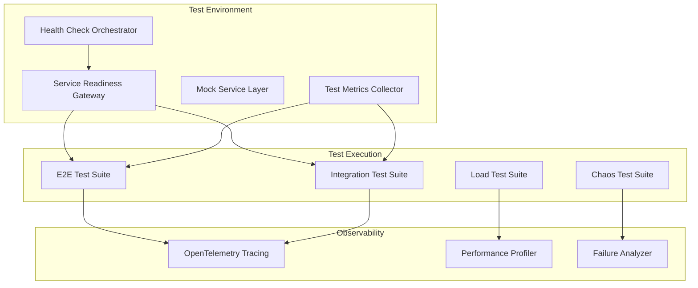
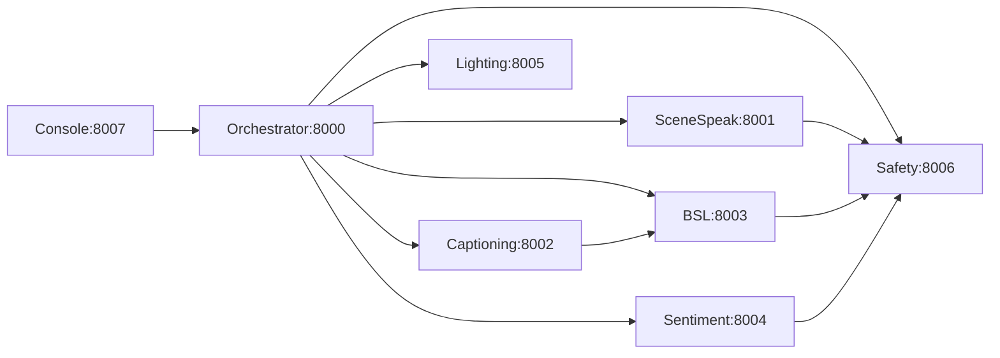
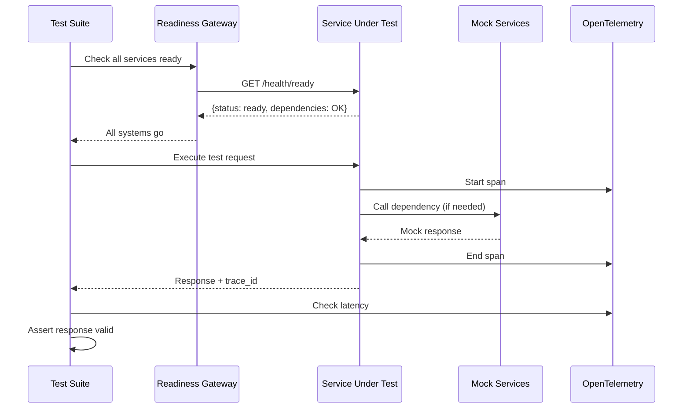
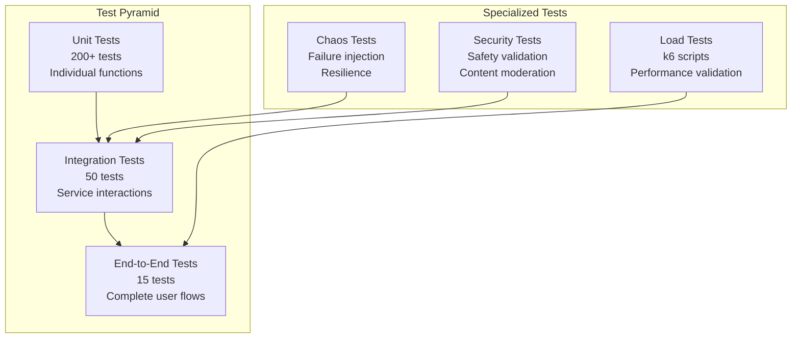

# Comprehensive Stabilization Design

> **For Claude:** REQUIRED SUB-SKILL: Use superpowers:executing-plans to implement this plan task-by-task.

**Goal:** Stabilize Project Chimera through fixing failing tests, adding comprehensive integration tests, performance validation, and implementing error handling

**Architecture:** Test infrastructure enhancements with service readiness gateway, standardized error responses, and comprehensive testing framework

**Tech Stack:** Playwright, k6, OpenTelemetry, tenacity, pybreaker

---

## Table of Contents

1. [Problem Analysis](#section-1-problem-analysis)
2. [Architecture](#section-2-architecture)
3. [Implementation Details](#section-3-implementation-details)
4. [Data Flow and Error Handling](#section-4-data-flow-and-error-handling)
5. [Testing Strategy](#section-5-testing-strategy)
6. [Implementation Roadmap](#section-6-implementation-roadmap)
7. [Technology Stack](#section-7-technology-stack)
8. [File Structure](#section-8-file-structure)

---

## Section 1: Problem Analysis

### Current Test Failures

Based on the E2E test output, the failures fall into these categories:

**WebSocket Connection Errors:**
- Multiple WebSocket failures in operator-console tests
- Services may not be fully ready when tests run
- Connection timing issues in distributed system

**BSL Agent Issues:**
- Validation error format inconsistencies
- `renderer_info` endpoint returning unexpected data
- Animation generation timing problems

**Captioning Agent Issues:**
- Health endpoint alias problems
- Transcription response format mismatches
- Timeout issues during audio processing

**Root Causes:**
1. **Race Conditions**: Tests start before services are fully initialized
2. **Inconsistent Error Responses**: Different services return different error formats
3. **Missing Dependencies**: Some services depend on others that aren't guaranteed ready
4. **Timeout Issues**: AI operations take variable time, tests have fixed timeouts

### Proposed Solutions

| Problem | Solution | Impact |
|---------|----------|--------|
| Race conditions | Enhanced service readiness probes with dependency checks | High |
| Inconsistent errors | Standardized error response Pydantic models across all services | High |
| Missing dependencies | Service dependency graph with ordered startup | Medium |
| Timeout issues | Adaptive timeouts + health checks before each test | Medium |

---

## Section 2: Architecture

### Test Infrastructure Architecture



### Component Overview

**Service Readiness Gateway** (New Component)
- Central health check coordinator
- Waits for all services to be truly ready (not just port open)
- Checks dependency chain (e.g., BSL depends on Sentiment)
- Provides `/test/ready` endpoint for test suites

**Standardized Error Response Model**
```python
class StandardErrorResponse(BaseModel):
    error: str
    code: str  # e.g., "VALIDATION_ERROR", "SERVICE_UNAVAILABLE"
    detail: Optional[str] = None
    timestamp: datetime
    request_id: str = Field(default_factory=lambda: uuid4().hex)
```

**Test Metrics Collector**
- Records test execution times, pass rates, flakiness
- Tracks which tests fail most often
- Feeds into CI/CD quality gates

### Service Dependency Graph



---

## Section 3: Implementation Details

### Phase 1: Fix Failing E2E Tests (Week 1)

**Task 1.1: Create Service Readiness Gateway**

File: `tests/helpers/service-readiness.ts`

```typescript
export class ServiceReadinessGateway {
  async waitForAllServices(timeout = 60000): Promise<boolean> {
    const services = [
      { url: 'http://localhost:8000/health/ready', name: 'orchestrator' },
      { url: 'http://localhost:8003/health/ready', name: 'bsl-agent' },
      // ... all services
    ];

    // Check with retries and dependency ordering
    for (const service of services) {
      await this.waitForService(service.url, timeout);
    }
    return true;
  }

  private async waitForService(url: string, timeout: number): Promise<void> {
    const start = Date.now();
    while (Date.now() - start < timeout) {
      try {
        const response = await fetch(url);
        if (response.ok) {
          const body = await response.json();
          if (body.status === 'ready') return;
        }
      } catch {}
      await sleep(500);
    }
    throw new Error(`Service not ready: ${url}`);
  }
}
```

**Task 1.2: Fix BSL Agent Validation Errors**

File: `services/bsl-agent/api/endpoints.py`

```python
from pydantic import BaseModel, Field

class ValidationError(BaseModel):
    error: str
    code: str = "VALIDATION_ERROR"
    detail: Optional[str] = None
    timestamp: datetime = Field(default_factory=datetime.utcnow)

@app.exception_handler(RequestValidationError)
async def validation_exception_handler(request, exc):
    return JSONResponse(
        status_code=422,
        content=ValidationError(
            error="Validation failed",
            detail=str(exc)
        ).dict()
    )
```

### Phase 2: Add Integration Tests (Week 2)

**Task 2.1: Create Scenario Tests**

File: `tests/integration/complete-show.spec.ts`

```typescript
test.describe('Complete Show Workflow', () => {
  test('@scenario audience input triggers AI response', async ({ request }) => {
    // 1. Audience sends input via Console
    const consoleResponse = await request.post('http://localhost:8007/api/input', {
      data: { text: 'Tell me a story', sentiment: 'curious' }
    });

    // 2. Orchestrator routes to SceneSpeak
    // 3. SceneSpeak generates dialogue
    // 4. Sentiment analyzes response
    // 5. Safety filter approves
    // 6. Response sent back to Console
    expect(consoleResponse.status()).toBe(200);
    expect(consoleResponse.data()).toHaveProperty('ai_response');
  });
});
```

### Phase 3: Performance Testing (Week 3)

**Task 3.1: End-to-End Latency Tracing**

File: `tests/performance/latency.spec.ts`

```typescript
test('@performance dialogue generation under 2s p95', async ({ request }) => {
  const timings = [];

  for (let i = 0; i < 50; i++) {
    const start = Date.now();
    await request.post('http://localhost:8001/api/generate', {
      data: { prompt: 'Say hello' }
    });
    timings.push(Date.now() - start);
  }

  const p95 = percentile(timings, 95);
  expect(p95).toBeLessThan(2000); // 2 second TRD requirement
});
```

### Phase 4: Error Handling & Resilience (Week 4)

**Task 4.1: Implement Retry with Exponential Backoff**

File: `shared/resilience.py`

```python
from tenacity import retry, stop_after_attempt, wait_exponential

@retry(
    stop=stop_after_attempt(3),
    wait=wait_exponential(multiplier=1, min=1, max=10)
)
async def call_service_with_retry(url: str, payload: dict):
    async with httpx.AsyncClient() as client:
        response = await client.post(url, json=payload, timeout=10.0)
        response.raise_for_status()
        return response.json()
```

**Task 4.2: Circuit Breaker Pattern**

File: `shared/circuit_breaker.py`

```python
from circuitbreaker import CircuitBreaker

bsl_breaker = CircuitBreaker(
    failure_threshold=5,
    recovery_timeout=60,
    expected_exception=RequestException
)

@bsl_breaker
async def generate_bsl_animation(text: str):
    # BSL generation call
    pass
```

---

## Section 4: Data Flow and Error Handling

### Enhanced Test Flow



### Error Response Standardization

**All services will return consistent error format:**

```json
{
  "error": "Human readable message",
  "code": "ERROR_CODE",
  "detail": "Additional context",
  "timestamp": "2026-03-12T10:30:00Z",
  "request_id": "abc123",
  "retryable": true
}
```

**Error Codes:**

| Code | Description | Retryable |
|------|-------------|-----------|
| `VALIDATION_ERROR` | Invalid input | No |
| `SERVICE_UNAVAILABLE` | Service down | Yes |
| `TIMEOUT` | Request timed out | Yes |
| `RATE_LIMITED` | Too many requests | Yes |
| `MODEL_NOT_LOADED` | ML model not ready | Yes |
| `SAFETY_REJECTED` | Content blocked | No |

---

## Section 5: Testing Strategy

### Test Pyramid for Project Chimera



### Test Categories and Coverage Goals

| Category | Target | Current | Gap |
|----------|--------|---------|-----|
| **Unit Tests** | 80% coverage | ~70% | 10% |
| **Integration Tests** | 50 scenarios | ~10 | 40 |
| **E2E Tests** | 95% pass rate | 87% | 8% |
| **Load Tests** | 50 concurrent users | 0 | 50 |
| **Chaos Tests** | All failure modes | 0 | All |

### Integration Test Scenarios

**Priority 1: Critical Paths (Must Have)**

1. **Audience Input → AI Response**: Full flow from Console to all agents
2. **Safety Filter Integration**: All content passes through Safety
3. **WebSocket Real-time Updates**: Sentiment and captioning streaming
4. **BSL Avatar Generation**: Text → Gloss → Animation → Display
5. **Show State Transitions**: Start → Pause → Resume → End

### Quality Gates

**Pre-commit:**
- Unit tests pass for changed files
- No new TODO/FIXME markers

**Pre-merge (PR):**
- All tests pass (unit + integration)
- Test coverage not decreased
- No flaky tests introduced

**Pre-deploy:**
- E2E tests pass (95%+ pass rate)
- Load tests pass baseline metrics
- Security scans pass
- Manual smoke test completed

---

## Section 6: Implementation Roadmap

### 4-Week Stabilization Sprint

| Week | Focus | Key Deliverables |
|------|-------|------------------|
| 1 | Fix E2E Tests | 95%+ pass rate, Service Readiness Gateway |
| 2 | Integration Tests | 50+ integration tests, 5 critical scenarios |
| 3 | Performance Testing | p95 latency targets, 50 concurrent user capacity |
| 4 | Error Handling | Retry logic, circuit breakers, graceful degradation |

### Success Criteria

**End of Week 1 (Fix Failing Tests):**
- ✅ All E2E tests passing (95%+ pass rate)
- ✅ No WebSocket connection errors
- ✅ All services report `/health/ready` correctly

**End of Week 2 (Integration Tests):**
- ✅ 50+ integration tests passing
- ✅ All 5 critical scenarios validated
- ✅ Test execution time < 10 minutes

**End of Week 3 (Performance Testing):**
- ✅ p95 latency under TRD targets (<5s e2e, <2s dialogue)
- ✅ System handles 50 concurrent users
- ✅ Performance baseline documented

**End of Week 4 (Error Handling):**
- ✅ Retry logic prevents cascading failures
- ✅ Graceful degradation tested
- ✅ System recovers from service failures

---

## Section 7: Technology Stack

### Testing & Reliability Tools

| Component | Technology | Purpose |
|-----------|------------|---------|
| **E2E Testing** | Playwright | Browser automation |
| **Load Testing** | k6 | Performance testing |
| **Tracing** | OpenTelemetry | Request tracing |
| **Profiling** | py-spy | Python profiling |
| **Retries** | tenacity | Retry logic |
| **Circuit Breaker** | pybreaker | Fault tolerance |

### New Dependencies

```bash
# Testing
pip install tenacity pybreaker py-spy

npm install -g k6

# Observability (already have)
pip install opentelemetry-api opentelemetry-sdk
```

---

## Section 8: File Structure

### New Files to Create

```
Project_Chimera/
├── tests/
│   ├── helpers/
│   │   ├── service-readiness.ts      # NEW
│   │   ├── flaky-detector.ts          # NEW
│   │   └── test-metrics.ts            # NEW
│   ├── integration/
│   │   ├── complete-show.spec.ts      # NEW
│   │   ├── websocket-flows.spec.ts    # NEW
│   │   └── failure-scenarios.spec.ts  # NEW
│   ├── performance/
│   │   ├── latency.spec.ts            # NEW
│   │   └── load-test-plan.md          # NEW
│   └── load/
│       ├── concurrent-users.js        # NEW
│       └── peak-load.js               # NEW
├── shared/
│   ├── resilience.py                  # NEW
│   └── circuit_breaker.py             # NEW
└── docs/
    └── plans/
        └── 2026-03-12-stabilization-implementation.md  # Implementation plan
```

---

## Open Questions

1. **Performance Baseline**: What are current p95 latencies for each service? (Need to measure first)
2. **Load Target**: Is 50 concurrent users sufficient for initial load testing?
3. **Chaos Testing**: Should we implement full chaos engineering (expensive) or simple failure injection?
4. **Service Dependencies**: Are there hidden dependencies not documented in the TRD?

---

**Next Step:** Use `superpowers:executing-plans` to implement this plan task-by-task.
